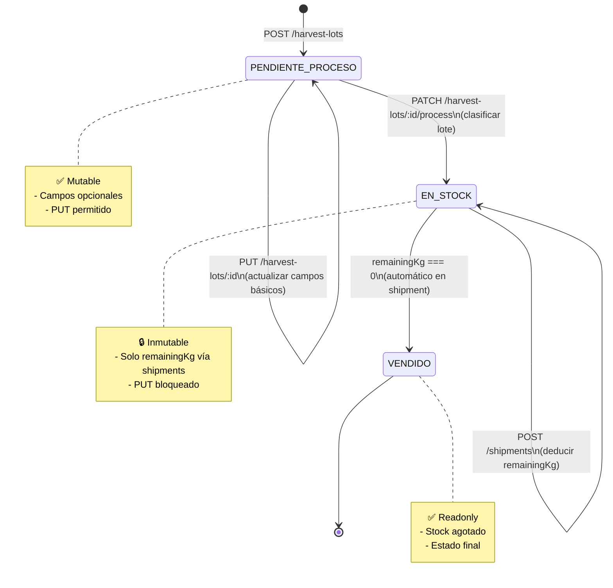

# Lifecycle de HarvestLot - Flujo de Inmutabilidad

## 📋 Resumen

Este documento describe el nuevo flujo del ciclo de vida de los lotes de cosecha (`HarvestLot`), diseñado para garantizar la **integridad de datos** mediante un sistema de **inmutabilidad progresiva**. Una vez que un lote es procesado y clasificado, se vuelve inmutable, excepto por actualizaciones controladas de inventario a través de envíos.

---

## 🔄 Estados del Lote

```
┌─────────────────────┐
│ PENDIENTE_PROCESO   │  ← Estado inicial (mutable)
│  - Campos opcionales│
│  - Actualizable     │
└──────────┬──────────┘
           │
           │ process() → classify
           ▼
┌─────────────────────┐
│    EN_STOCK         │  ← Estado procesado (inmutable)
│  - Campos completos │
│  - Solo inventario  │
└──────────┬──────────┘
           │
           │ shipment deductions
           ▼
┌─────────────────────┐
│     VENDIDO         │  ← Estado final
│  - remainingKg = 0  │
└─────────────────────┘
```

---

## 📝 Fase 1: Creación (PENDIENTE_PROCESO)

### Endpoint
```http
POST /harvest-lots
```

### DTO: CreateHarvestLotDto

```typescript
{
  plotId: string;           // Requerido
  harvestDate: Date;        // Requerido
  grossWeightKg: number;    // Requerido
  lotCode?: string;         // Opcional
  varietyName?: string;     // Opcional
  caliber?: WalnutCaliber;  // Opcional
}
```

### Comportamiento

- **Estado inicial**: `PENDIENTE_PROCESO`
- **Campos opcionales**: `lotCode`, `varietyName`, `caliber` pueden ser `null`
- **Campos calculados**: `netWeightKg`, `remainingNetWeightKg`, `yieldPercentage` son `null`
- **Mutabilidad**: ✅ **COMPLETAMENTE MUTABLE**

### Permisos
- `ADMIN`
- `CAPATAZ`

### Ejemplo
```json
{
  "plotId": "uuid-plot-1",
  "harvestDate": "2024-01-15",
  "grossWeightKg": 1000.5
}
```

---

## ✏️ Fase 2: Actualización (Solo PENDIENTE_PROCESO)

### Endpoint
```http
PUT /harvest-lots/:id
```

### DTO: UpdateHarvestLotDto

```typescript
{
  harvestDate?: Date;
  lotCode?: string;
  varietyName?: string;
  caliber?: WalnutCaliber;
  grossWeightKg?: number;
}
```

### Comportamiento

- **Validación de estado**: Solo funciona si `status === PENDIENTE_PROCESO`
- **Campos permitidos**: Solo los campos básicos del DTO
- **Campos bloqueados**: `netWeightKg`, `remainingNetWeightKg`, `yieldPercentage`, `status`
- **Error si EN_STOCK**: HTTP 400 con mensaje explicativo

### Validaciones

```typescript
if (harvestLot.status !== HarvestLotStatus.PENDIENTE_PROCESO) {
  throw new HttpException(
    StatusCodes.BAD_REQUEST,
    'No se puede actualizar un lote en estado EN_STOCK. ' +
    'Use el endpoint de procesamiento para clasificar el lote.'
  );
}
```

### Permisos
- `ADMIN`
- `CAPATAZ`

### Ejemplo
```json
{
  "lotCode": "LOT-2024-001",
  "varietyName": "Chandler",
  "grossWeightKg": 1005.0
}
```

---

## 🔧 Fase 3: Procesamiento/Clasificación (PENDIENTE_PROCESO → EN_STOCK)

### Endpoint
```http
PATCH /harvest-lots/:id/process
```

### DTO: ProcessHarvestLotDto

```typescript
{
  varietyName: string;       // Requerido
  caliber: WalnutCaliber;    // Requerido
  netWeightKg: number;       // Requerido
  lotCode?: string;          // Opcional (actualización final)
}
```

### Comportamiento

1. **Validación de estado**:
   ```typescript
   if (status !== PENDIENTE_PROCESO) {
     throw new HttpException(400, 'Solo se pueden procesar lotes PENDIENTE_PROCESO');
   }
   ```

2. **Validación de pesos**:
   ```typescript
   if (netWeightKg > grossWeightKg) {
     throw new HttpException(400, 'Peso neto no puede exceder peso bruto');
   }
   ```

3. **Establecer clasificación**:
   ```typescript
   harvestLot.varietyName = dto.varietyName;
   harvestLot.caliber = dto.caliber;
   harvestLot.netWeightKg = dto.netWeightKg;
   ```

4. **Inicializar inventario**:
   ```typescript
   harvestLot.remainingNetWeightKg = dto.netWeightKg;
   ```

5. **Calcular rendimiento**:
   ```typescript
   harvestLot.yieldPercentage = (netWeightKg / grossWeightKg) * 100;
   ```

6. **Cambiar estado**:
   ```typescript
   harvestLot.status = HarvestLotStatus.EN_STOCK;
   ```

### Permisos
- `ADMIN`
- `CAPATAZ`

### Ejemplo
```json
{
  "varietyName": "Chandler",
  "caliber": "CALIBER_32_34",
  "netWeightKg": 850.75,
  "lotCode": "LOT-2024-001-CLASSIFIED"
}
```

### Respuesta
```json
{
  "data": {
    "id": "uuid-lot-1",
    "plotId": "uuid-plot-1",
    "lotCode": "LOT-2024-001-CLASSIFIED",
    "varietyName": "Chandler",
    "caliber": "CALIBER_32_34",
    "grossWeightKg": 1005.0,
    "netWeightKg": 850.75,
    "remainingNetWeightKg": 850.75,
    "yieldPercentage": 84.65,
    "status": "EN_STOCK",
    "harvestDate": "2024-01-15"
  },
  "message": "Lote de cosecha procesado y clasificado exitosamente. El lote ahora es inmutable."
}
```

---

## 🚫 Fase 4: Inmutabilidad (EN_STOCK / VENDIDO)

### Reglas

Una vez que `status === EN_STOCK`:

✅ **PERMITIDO**:
- Consultar información (`GET /harvest-lots/:id`)
- Modificar `remainingNetWeightKg` **SOLO** a través de `POST /shipments`
- Cambiar `status` a `VENDIDO` **SOLO** cuando `remainingNetWeightKg === 0`

❌ **BLOQUEADO**:
- `PUT /harvest-lots/:id` → HTTP 400
- `PATCH /harvest-lots/:id/process` → HTTP 400
- Cualquier modificación manual de:
  - `netWeightKg`
  - `yieldPercentage`
  - `varietyName`
  - `caliber`
  - `grossWeightKg`
  - `harvestDate`
  - `lotCode`

### Error Response

```json
{
  "error": {
    "statusCode": 400,
    "message": "No se puede actualizar un lote en estado EN_STOCK. Use el endpoint de procesamiento para clasificar el lote."
  }
}
```

---

## 📦 Fase 5: Envíos (Deducción de Inventario)

### Endpoint
```http
POST /shipments
```

### Comportamiento

```typescript
// En shipment.service.ts (dentro de transacción)
for (const lotDetail of dto.lotDetails) {
  const harvestLot = await harvestLotRepository.findOneBy({ id: lotDetail.harvestLotId });

  // Validar stock disponible
  if (harvestLot.remainingNetWeightKg < lotDetail.netWeightKg) {
    throw new HttpException(400, 'Stock insuficiente');
  }

  // Deducir inventario
  harvestLot.remainingNetWeightKg -= lotDetail.netWeightKg;

  // Cambiar estado si se agota
  if (harvestLot.remainingNetWeightKg === 0) {
    harvestLot.status = HarvestLotStatus.VENDIDO;
  }

  await harvestLotRepository.save(harvestLot);
}
```

### Ejemplo
```json
{
  "salesOrderId": "uuid-order-1",
  "lotDetails": [
    {
      "harvestLotId": "uuid-lot-1",
      "netWeightKg": 100.5
    }
  ]
}
```

### Efecto
```
remainingNetWeightKg: 850.75 → 750.25
status: EN_STOCK (sin cambios, aún hay stock)
```

---

## 🔒 Garantías de Integridad

### 1. **Inmutabilidad de Clasificación**
- Una vez procesado, `varietyName`, `caliber`, `netWeightKg` **NO** pueden cambiar
- Previene inconsistencias entre envíos y clasificación original

### 2. **Trazabilidad de Inventario**
- `remainingNetWeightKg` se actualiza **SOLO** en transacciones de envío
- Previene modificaciones manuales que rompan trazabilidad

### 3. **Integridad Referencial**
- Si `harvestLot.remainingNetWeightKg < shipmentAmount`:
  - Transacción hace ROLLBACK
  - HTTP 400: "Stock insuficiente"

### 4. **Auditabilidad**
- `createdAt`: Fecha de creación del lote
- `updatedAt`: Última modificación (solo en PENDIENTE_PROCESO o envíos)
- `deletedAt`: Soft delete (preserva histórico)

---

## 📊 Diagrama de Flujo Completo



---

## 🧪 Ejemplos de Uso

### Escenario Completo: Desde Cosecha hasta Venta

#### 1. Crear lote sin clasificar
```http
POST /harvest-lots
Content-Type: application/json

{
  "plotId": "uuid-plot-1",
  "harvestDate": "2024-01-15",
  "grossWeightKg": 1000.0
}
```

**Respuesta**:
```json
{
  "data": {
    "id": "uuid-lot-1",
    "status": "PENDIENTE_PROCESO",
    "netWeightKg": null,
    "remainingNetWeightKg": null
  }
}
```

---

#### 2. Actualizar información básica
```http
PUT /harvest-lots/uuid-lot-1
Content-Type: application/json

{
  "lotCode": "LOT-2024-001",
  "varietyName": "Chandler"
}
```

**Respuesta**:
```json
{
  "data": {
    "id": "uuid-lot-1",
    "lotCode": "LOT-2024-001",
    "varietyName": "Chandler",
    "status": "PENDIENTE_PROCESO"
  }
}
```

---

#### 3. Procesar y clasificar
```http
PATCH /harvest-lots/uuid-lot-1/process
Content-Type: application/json

{
  "varietyName": "Chandler",
  "caliber": "CALIBER_32_34",
  "netWeightKg": 850.0
}
```

**Respuesta**:
```json
{
  "data": {
    "id": "uuid-lot-1",
    "status": "EN_STOCK",
    "netWeightKg": 850.0,
    "remainingNetWeightKg": 850.0,
    "yieldPercentage": 85.0
  },
  "message": "Lote procesado. Ahora es inmutable."
}
```

---

#### 4. Intentar actualizar (❌ BLOQUEADO)
```http
PUT /harvest-lots/uuid-lot-1
Content-Type: application/json

{
  "netWeightKg": 900.0
}
```

**Respuesta**:
```json
{
  "error": {
    "statusCode": 400,
    "message": "No se puede actualizar un lote en estado EN_STOCK..."
  }
}
```

---

#### 5. Crear envío (✅ Única forma de modificar)
```http
POST /shipments
Content-Type: application/json

{
  "salesOrderId": "uuid-order-1",
  "lotDetails": [
    {
      "harvestLotId": "uuid-lot-1",
      "netWeightKg": 850.0
    }
  ]
}
```

**Efecto**:
```json
{
  "harvestLot": {
    "remainingNetWeightKg": 0,
    "status": "VENDIDO"
  }
}
```

---

## 🔐 Control de Acceso

| Endpoint | ADMIN | CAPATAZ | VENDEDOR |
|----------|-------|---------|----------|
| `POST /harvest-lots` | ✅ | ✅ | ❌ |
| `GET /harvest-lots` | ✅ | ✅ | ❌ |
| `PUT /harvest-lots/:id` | ✅ | ✅ | ❌ |
| `PATCH /harvest-lots/:id/process` | ✅ | ✅ | ❌ |
| `DELETE /harvest-lots/:id` | ✅ | ❌ | ❌ |
| `POST /shipments` (indirecto) | ✅ | ✅ | ✅ |

---

## 📚 Referencias

- **Entity**: `src/entities/harvest-lot.entity.ts`
- **Service**: `src/services/harvest-lot.service.ts`
- **Controller**: `src/controllers/harvest-lot.controller.ts`
- **DTOs**: `src/dtos/harvest-lot.dto.ts`
- **Routes**: `src/routes/harvest-lot.routes.ts`
- **Shipment Logic**: `src/services/shipment.service.ts`

---

## ✅ Checklist de Validación

- [x] `CreateHarvestLotDto` permite campos opcionales
- [x] `UpdateHarvestLotDto` solo funciona en `PENDIENTE_PROCESO`
- [x] `ProcessHarvestLotDto` requiere clasificación completa
- [x] `process()` method valida estado y pesos
- [x] `update()` method bloquea modificaciones en `EN_STOCK`
- [x] Shipments modifican `remainingNetWeightKg` transaccionalmente
- [x] Estado `VENDIDO` se establece automáticamente al agotar stock
- [x] Permisos de `ADMIN` y `CAPATAZ` configurados
- [x] Documentación actualizada

---

## 🎯 Próximos Pasos

1. ✅ Implementar lógica de procesamiento
2. ✅ Actualizar validaciones de inmutabilidad
3. ✅ Agregar endpoint `PATCH /harvest-lots/:id/process`
4. ⏳ Actualizar tests unitarios
5. ⏳ Actualizar tests de integración
6. ⏳ Documentar en Postman/Swagger
