# 🛒 Módulo de Compras

## Índice
- [Descripción General](#descripción-general)
- [Entidades del Módulo](#entidades-del-módulo)
- [Flujo de Compras](#flujo-de-compras)
- [Componentes](#componentes)
- [Endpoints](#endpoints)
- [Casos de Uso](#casos-de-uso)
- [Reglas de Negocio](#reglas-de-negocio)

---

## Descripción General

El módulo de compras gestiona todo el ciclo de adquisición de nueces desde proveedores, incluyendo la gestión de proveedores, órdenes de compra y recepciones de mercadería con actualización automática de inventario.

### Características Principales

- ✅ **Gestión de Proveedores** - CRUD completo con filtros
- ✅ **Órdenes de Compra** - Creación, seguimiento y aprobación
- ✅ **Recepciones de Mercadería** - Registro con actualización de stock
- ✅ **Trazabilidad Completa** - Desde proveedor hasta inventario
- ✅ **Workflow de Aprobación** - CAPATAZ crea → ADMIN aprueba
- ✅ **Gestión de Precios** - Histórico y actualización por recepción
- ✅ **Control de Calibres** - Gestión por calibre de nuez

### Estado

🟢 **Implementado y Funcional**

---

## Entidades del Módulo

### 1. Supplier (Proveedor)

Representa a los proveedores de nueces.

| Campo | Tipo | Descripción | Constraints |
|-------|------|-------------|-------------|
| `id` | uuid | Identificador único | PK |
| `name` | varchar | Nombre del proveedor | NOT NULL |
| `contactName` | varchar | Persona de contacto | Optional |
| `email` | varchar | Email de contacto | UNIQUE, Optional |
| `phone` | varchar | Teléfono | Optional |
| `address` | varchar | Dirección | Optional |
| `city` | varchar | Ciudad | Optional |
| `notes` | text | Observaciones | Optional |
| `createdAt` | timestamp | Fecha de creación | Auto |
| `updatedAt` | timestamp | Última actualización | Auto |
| `deletedAt` | timestamp | Eliminación lógica | Nullable |

**Relaciones:**
- **1:N** → PurchaseOrder (purchaseOrders)
- **1:N** → GoodsReceipt (goodsReceipts)

---

### 2. PurchaseOrder (Orden de Compra)

Orden de compra de nueces a un proveedor.

| Campo | Tipo | Descripción | Constraints |
|-------|------|-------------|-------------|
| `id` | uuid | Identificador único | PK |
| `orderNumber` | varchar | Número de orden (auto) | UNIQUE, AUTO |
| `supplierId` | uuid | Proveedor | FK → Supplier, NOT NULL |
| `orderDate` | date | Fecha de la orden | NOT NULL, DEFAULT: today |
| `expectedDeliveryDate` | date | Fecha esperada de entrega | Optional |
| `status` | enum | Estado de la orden | PENDING \| APPROVED \| RECEIVED \| CANCELLED |
| `totalAmount` | decimal(10,2) | Monto total | NOT NULL |
| `approvedBy` | uuid | Usuario que aprobó | FK → User (ADMIN) |
| `approvedAt` | timestamp | Fecha de aprobación | Nullable |
| `notes` | text | Observaciones | Optional |
| `createdAt` | timestamp | Fecha de creación | Auto |
| `updatedAt` | timestamp | Última actualización | Auto |
| `deletedAt` | timestamp | Eliminación lógica | Nullable |

**Estados Posibles:**
- `PENDING`: Creada, pendiente de aprobación
- `APPROVED`: Aprobada por ADMIN
- `RECEIVED`: Mercadería recibida (total o parcialmente)
- `CANCELLED`: Cancelada

**Relaciones:**
- **N:1** → Supplier (supplier)
- **N:1** → User (approvedByUser)
- **1:N** → PurchaseOrderDetail (details)
- **1:N** → GoodsReceipt (goodsReceipts)

---

### 3. PurchaseOrderDetail (Detalle de Orden)

Línea de detalle de una orden de compra (por calibre).

| Campo | Tipo | Descripción | Constraints |
|-------|------|-------------|-------------|
| `id` | uuid | Identificador único | PK |
| `purchaseOrderId` | uuid | Orden de compra | FK → PurchaseOrder, NOT NULL |
| `caliber` | enum | Calibre de nuez | WalnutCaliber, NOT NULL |
| `quantity` | decimal(10,2) | Cantidad (kg) | NOT NULL, > 0 |
| `unitPrice` | decimal(10,2) | Precio por kg | NOT NULL, >= 0 |
| `subtotal` | decimal(10,2) | Cantidad * Precio | CALCULATED |

**Calibres Disponibles (WalnutCaliber):**
- `CHANDLER`
- `SERR`
- `HOWARD`
- `VINA`
- `OTHER`

**Relaciones:**
- **N:1** → PurchaseOrder (purchaseOrder)

**Constraint Único:**
```typescript
@Unique(['purchaseOrderId', 'caliber'])
// No se puede repetir el mismo calibre en una orden
```

---

### 4. GoodsReceipt (Recepción de Mercadería)

Registro de recepción de nueces compradas.

| Campo | Tipo | Descripción | Constraints |
|-------|------|-------------|-------------|
| `id` | uuid | Identificador único | PK |
| `receiptNumber` | varchar | Número de recepción (auto) | UNIQUE, AUTO |
| `supplierId` | uuid | Proveedor | FK → Supplier, NOT NULL |
| `purchaseOrderId` | uuid | Orden de compra asociada | FK → PurchaseOrder, Optional |
| `receiptDate` | date | Fecha de recepción | NOT NULL, DEFAULT: today |
| `totalQuantity` | decimal(10,2) | Cantidad total (kg) | CALCULATED |
| `totalAmount` | decimal(10,2) | Monto total | CALCULATED |
| `notes` | text | Observaciones | Optional |
| `createdAt` | timestamp | Fecha de creación | Auto |
| `updatedAt` | timestamp | Última actualización | Auto |
| `deletedAt` | timestamp | Eliminación lógica | Nullable |

**Relaciones:**
- **N:1** → Supplier (supplier)
- **N:1** → PurchaseOrder (purchaseOrder) - opcional
- **1:N** → GoodsReceiptDetail (details)

**Nota:** `purchaseOrderId` es opcional porque se puede recibir mercadería sin orden previa.

---

### 5. GoodsReceiptDetail (Detalle de Recepción)

Detalle de recepción por calibre con actualización de inventario.

| Campo | Tipo | Descripción | Constraints |
|-------|------|-------------|-------------|
| `id` | uuid | Identificador único | PK |
| `goodsReceiptId` | uuid | Recepción asociada | FK → GoodsReceipt, NOT NULL |
| `caliber` | enum | Calibre de nuez | WalnutCaliber, NOT NULL |
| `quantity` | decimal(10,2) | Cantidad recibida (kg) | NOT NULL, > 0 |
| `unitPrice` | decimal(10,2) | Precio por kg | NOT NULL, >= 0 |
| `subtotal` | decimal(10,2) | Cantidad * Precio | CALCULATED |

**Relaciones:**
- **N:1** → GoodsReceipt (goodsReceipt)

**Constraint Único:**
```typescript
@Unique(['goodsReceiptId', 'caliber'])
// No se puede repetir el mismo calibre en una recepción
```

**⚠️ Importante:** Al crear un `GoodsReceiptDetail`, automáticamente se crea o actualiza un `HarvestLot` con:
- `source = 'PURCHASE'`
- `supplierId = goodsReceipt.supplierId`
- `caliber = detail.caliber`
- `quantity = detail.quantity`

---

## Flujo de Compras

### Diagrama de Estados

```mermaid
stateDiagram-v2
    [*] --> PENDING: CAPATAZ crea orden
    PENDING --> APPROVED: ADMIN aprueba
    PENDING --> CANCELLED: ADMIN cancela
    APPROVED --> RECEIVED: Se registra recepción
    RECEIVED --> [*]: Finalizado
    CANCELLED --> [*]: Finalizado
```



---

### Flujo Completo


---

## Componentes

### 1. Supplier Controller

```typescript
class SupplierController {
  /**
   * GET /suppliers
   * Obtener todos los proveedores
   * Query: ?search=nombre&city=ciudad
   */
  async getAll(req: Request, res: Response): Promise<void>
  
  /**
   * GET /suppliers/:id
   * Obtener proveedor por ID
   */
  async getById(req: Request, res: Response): Promise<void>
  
  /**
   * POST /suppliers
   * Crear nuevo proveedor
   * Solo ADMIN y CAPATAZ
   */
  async create(req: Request, res: Response): Promise<void>
  
  /**
   * PUT /suppliers/:id
   * Actualizar proveedor
   * Solo ADMIN y CAPATAZ
   */
  async update(req: Request, res: Response): Promise<void>
  
  /**
   * DELETE /suppliers/:id
   * Eliminar proveedor (soft delete)
   * Solo ADMIN
   */
  async delete(req: Request, res: Response): Promise<void>
}
```

---

### 2. Purchase Order Controller

```typescript
class PurchaseOrderController {
  /**
   * GET /purchase-orders
   * Listar órdenes de compra
   * Query: ?status=PENDING&supplierId=uuid
   */
  async getAll(req: Request, res: Response): Promise<void>
  
  /**
   * GET /purchase-orders/:id
   * Obtener orden con detalles
   */
  async getById(req: Request, res: Response): Promise<void>
  
  /**
   * POST /purchase-orders
   * Crear orden de compra
   * Solo ADMIN y CAPATAZ
   */
  async create(req: Request, res: Response): Promise<void>
  
  /**
   * PUT /purchase-orders/:id
   * Actualizar orden (solo si status = PENDING)
   */
  async update(req: Request, res: Response): Promise<void>
  
  /**
   * PATCH /purchase-orders/:id/approve
   * Aprobar orden de compra
   * Solo ADMIN
   */
  async approve(req: Request, res: Response): Promise<void>
  
  /**
   * PATCH /purchase-orders/:id/cancel
   * Cancelar orden de compra
   * Solo ADMIN
   */
  async cancel(req: Request, res: Response): Promise<void>
  
  /**
   * DELETE /purchase-orders/:id
   * Eliminar orden (soft delete)
   * Solo ADMIN, solo si status = PENDING o CANCELLED
   */
  async delete(req: Request, res: Response): Promise<void>
}
```

---

### 3. Goods Receipt Controller

```typescript
class GoodsReceiptController {
  /**
   * GET /goods-receipts
   * Listar recepciones
   * Query: ?supplierId=uuid&startDate=2025-01-01&endDate=2025-01-31
   */
  async getAll(req: Request, res: Response): Promise<void>
  
  /**
   * GET /goods-receipts/:id
   * Obtener recepción con detalles
   */
  async getById(req: Request, res: Response): Promise<void>
  
  /**
   * POST /goods-receipts
   * Registrar recepción de mercadería
   * Solo ADMIN y CAPATAZ
   */
  async create(req: Request, res: Response): Promise<void>
  
  /**
   * PUT /goods-receipts/:id
   * Actualizar recepción
   * Solo ADMIN
   */
  async update(req: Request, res: Response): Promise<void>
  
  /**
   * DELETE /goods-receipts/:id
   * Eliminar recepción (soft delete)
   * Solo ADMIN
   * ⚠️ También elimina HarvestLots asociados
   */
  async delete(req: Request, res: Response): Promise<void>
}
```

---

## Endpoints

### 📦 Suppliers

#### GET /suppliers

Obtener lista de proveedores con filtros.

**Autorización:** Autenticado (todos los roles)

**Query Parameters:**
- `search` (string): Búsqueda por nombre
- `city` (string): Filtrar por ciudad
- `includeDeleted` (boolean): Incluir eliminados (solo ADMIN)

**Request:**
```
GET /suppliers?search=García&city=Mendoza
Authorization: Bearer {token}
```

**Response (200):**
```json
[
  {
    "id": "supplier-uuid-1",
    "name": "Proveedor García",
    "contactName": "Juan García",
    "email": "garcia@proveedores.com",
    "phone": "+54 261 4567890",
    "address": "Calle Falsa 123",
    "city": "Mendoza",
    "notes": "Proveedor confiable",
    "createdAt": "2025-01-01T00:00:00.000Z"
  }
]
```

---

#### POST /suppliers

Crear nuevo proveedor.

**Autorización:** ADMIN o CAPATAZ

**Request:**
```json
POST /suppliers
Authorization: Bearer {token}
Content-Type: application/json

{
  "name": "Nuevo Proveedor SRL",
  "contactName": "Pedro Martínez",
  "email": "pedro@nuevoproveedor.com",
  "phone": "+54 261 1234567",
  "address": "Av. Principal 456",
  "city": "San Rafael",
  "notes": "Especializado en calibre CHANDLER"
}
```

**Response (201):**
```json
{
  "id": "new-supplier-uuid",
  "name": "Nuevo Proveedor SRL",
  "contactName": "Pedro Martínez",
  "email": "pedro@nuevoproveedor.com",
  "phone": "+54 261 1234567",
  "address": "Av. Principal 456",
  "city": "San Rafael",
  "notes": "Especializado en calibre CHANDLER",
  "createdAt": "2025-01-15T10:30:00.000Z"
}
```

---

### 📋 Purchase Orders

#### GET /purchase-orders

Listar órdenes de compra con filtros.

**Autorización:** Autenticado

**Query Parameters:**
- `status` (enum): Filtrar por estado
- `supplierId` (uuid): Filtrar por proveedor
- `startDate` (date): Desde fecha
- `endDate` (date): Hasta fecha

**Request:**
```
GET /purchase-orders?status=APPROVED&supplierId=supplier-uuid-1
Authorization: Bearer {token}
```

**Response (200):**
```json
[
  {
    "id": "po-uuid-1",
    "orderNumber": "PO-2025-001",
    "supplier": {
      "id": "supplier-uuid-1",
      "name": "Proveedor García"
    },
    "orderDate": "2025-01-10",
    "expectedDeliveryDate": "2025-01-20",
    "status": "APPROVED",
    "totalAmount": 15000.00,
    "approvedBy": {
      "id": "admin-uuid",
      "name": "Admin Sistema"
    },
    "approvedAt": "2025-01-11T09:00:00.000Z",
    "details": [
      {
        "id": "detail-uuid-1",
        "caliber": "CHANDLER",
        "quantity": 500.00,
        "unitPrice": 20.00,
        "subtotal": 10000.00
      },
      {
        "id": "detail-uuid-2",
        "caliber": "SERR",
        "quantity": 250.00,
        "unitPrice": 20.00,
        "subtotal": 5000.00
      }
    ],
    "createdAt": "2025-01-10T08:00:00.000Z"
  }
]
```

---

#### POST /purchase-orders

Crear nueva orden de compra.

**Autorización:** ADMIN o CAPATAZ

**Request:**
```json
POST /purchase-orders
Authorization: Bearer {token}
Content-Type: application/json

{
  "supplierId": "supplier-uuid-1",
  "orderDate": "2025-01-15",
  "expectedDeliveryDate": "2025-01-25",
  "notes": "Urgente para cosecha",
  "details": [
    {
      "caliber": "CHANDLER",
      "quantity": 1000.00,
      "unitPrice": 22.00
    },
    {
      "caliber": "HOWARD",
      "quantity": 500.00,
      "unitPrice": 18.00
    }
  ]
}
```

**Validaciones:**
- `supplierId` debe existir
- `details` no puede estar vacío
- No puede haber calibres duplicados
- `quantity` y `unitPrice` deben ser > 0
- `totalAmount` se calcula automáticamente

**Response (201):**
```json
{
  "id": "new-po-uuid",
  "orderNumber": "PO-2025-015",
  "supplierId": "supplier-uuid-1",
  "orderDate": "2025-01-15",
  "expectedDeliveryDate": "2025-01-25",
  "status": "PENDING",
  "totalAmount": 31000.00,
  "notes": "Urgente para cosecha",
  "details": [
    {
      "id": "detail-uuid-3",
      "caliber": "CHANDLER",
      "quantity": 1000.00,
      "unitPrice": 22.00,
      "subtotal": 22000.00
    },
    {
      "id": "detail-uuid-4",
      "caliber": "HOWARD",
      "quantity": 500.00,
      "unitPrice": 18.00,
      "subtotal": 9000.00
    }
  ],
  "createdAt": "2025-01-15T10:00:00.000Z"
}
```

---

#### PATCH /purchase-orders/:id/approve

Aprobar orden de compra.

**Autorización:** Solo ADMIN

**Request:**
```
PATCH /purchase-orders/po-uuid-1/approve
Authorization: Bearer {admin-token}
```

**Validaciones:**
- Orden debe existir
- Status debe ser PENDING
- Solo ADMIN puede aprobar

**Response (200):**
```json
{
  "id": "po-uuid-1",
  "orderNumber": "PO-2025-001",
  "status": "APPROVED",
  "approvedBy": "admin-uuid",
  "approvedAt": "2025-01-16T14:30:00.000Z",
  "updatedAt": "2025-01-16T14:30:00.000Z"
}
```

---

#### PATCH /purchase-orders/:id/cancel

Cancelar orden de compra.

**Autorización:** Solo ADMIN

**Request:**
```
PATCH /purchase-orders/po-uuid-1/cancel
Authorization: Bearer {admin-token}
```

**Validaciones:**
- Orden debe existir
- Status debe ser PENDING o APPROVED (no RECEIVED)
- Solo ADMIN puede cancelar

**Response (200):**
```json
{
  "id": "po-uuid-1",
  "orderNumber": "PO-2025-001",
  "status": "CANCELLED",
  "updatedAt": "2025-01-16T15:00:00.000Z"
}
```

---

### 📥 Goods Receipts

#### GET /goods-receipts

Listar recepciones de mercadería.

**Autorización:** Autenticado

**Query Parameters:**
- `supplierId` (uuid): Filtrar por proveedor
- `purchaseOrderId` (uuid): Filtrar por orden de compra
- `startDate` (date): Desde fecha
- `endDate` (date): Hasta fecha

**Request:**
```
GET /goods-receipts?supplierId=supplier-uuid-1&startDate=2025-01-01
Authorization: Bearer {token}
```

**Response (200):**
```json
[
  {
    "id": "gr-uuid-1",
    "receiptNumber": "GR-2025-001",
    "supplier": {
      "id": "supplier-uuid-1",
      "name": "Proveedor García"
    },
    "purchaseOrder": {
      "id": "po-uuid-1",
      "orderNumber": "PO-2025-001"
    },
    "receiptDate": "2025-01-20",
    "totalQuantity": 750.00,
    "totalAmount": 15000.00,
    "details": [
      {
        "id": "grd-uuid-1",
        "caliber": "CHANDLER",
        "quantity": 500.00,
        "unitPrice": 20.00,
        "subtotal": 10000.00
      },
      {
        "id": "grd-uuid-2",
        "caliber": "SERR",
        "quantity": 250.00,
        "unitPrice": 20.00,
        "subtotal": 5000.00
      }
    ],
    "createdAt": "2025-01-20T11:00:00.000Z"
  }
]
```

---

#### POST /goods-receipts

Registrar recepción de mercadería.

**Autorización:** ADMIN o CAPATAZ

**Request:**
```json
POST /goods-receipts
Authorization: Bearer {token}
Content-Type: application/json

{
  "supplierId": "supplier-uuid-1",
  "purchaseOrderId": "po-uuid-1",
  "receiptDate": "2025-01-20",
  "notes": "Mercadería en perfectas condiciones",
  "details": [
    {
      "caliber": "CHANDLER",
      "quantity": 500.00,
      "unitPrice": 20.00
    },
    {
      "caliber": "SERR",
      "quantity": 250.00,
      "unitPrice": 20.00
    }
  ]
}
```

**Validaciones:**
- `supplierId` debe existir
- `purchaseOrderId` opcional (debe existir si se proporciona)
- `details` no puede estar vacío
- No puede haber calibres duplicados
- `quantity` y `unitPrice` > 0

**Proceso Automático:**
1. Crea `GoodsReceipt`
2. Crea `GoodsReceiptDetail` para cada línea
3. **Crea o actualiza `HarvestLot`** con:
   - `source = 'PURCHASE'`
   - `supplierId = goodsReceipt.supplierId`
   - `caliber = detail.caliber`
   - `quantity = detail.quantity`
   - `status = 'IN_STOCK'`
4. Actualiza `PurchaseOrder.status = 'RECEIVED'` si está asociada

**Response (201):**
```json
{
  "id": "new-gr-uuid",
  "receiptNumber": "GR-2025-010",
  "supplierId": "supplier-uuid-1",
  "purchaseOrderId": "po-uuid-1",
  "receiptDate": "2025-01-20",
  "totalQuantity": 750.00,
  "totalAmount": 15000.00,
  "notes": "Mercadería en perfectas condiciones",
  "details": [
    {
      "id": "new-grd-uuid-1",
      "caliber": "CHANDLER",
      "quantity": 500.00,
      "unitPrice": 20.00,
      "subtotal": 10000.00
    },
    {
      "id": "new-grd-uuid-2",
      "caliber": "SERR",
      "quantity": 250.00,
      "unitPrice": 20.00,
      "subtotal": 5000.00
    }
  ],
  "createdAt": "2025-01-20T11:30:00.000Z",
  "harvestLotsCreated": [
    {
      "id": "hl-uuid-1",
      "source": "PURCHASE",
      "caliber": "CHANDLER",
      "quantity": 500.00
    },
    {
      "id": "hl-uuid-2",
      "source": "PURCHASE",
      "caliber": "SERR",
      "quantity": 250.00
    }
  ]
}
```

---

## Casos de Uso

### Caso 1: CAPATAZ Crea Orden de Compra

**Actor:** CAPATAZ

**Flujo:**
1. CAPATAZ revisa inventario y detecta faltante de calibre CHANDLER
2. Crea orden de compra a proveedor de confianza
3. Sistema genera número de orden automático (PO-2025-XXX)
4. Orden queda en estado PENDING
5. ADMIN es notificado para aprobación

**Código:**
```typescript
const createPurchaseOrder = async () => {
  const order = await purchaseOrderService.create({
    supplierId: 'supplier-uuid-garcia',
    orderDate: '2025-01-15',
    expectedDeliveryDate: '2025-01-25',
    notes: 'Urgente - Falta CHANDLER para pedido cliente',
    details: [
      {
        caliber: WalnutCaliber.CHANDLER,
        quantity: 1000,
        unitPrice: 22
      }
    ]
  });
  
  // order.status === 'PENDING'
  // order.orderNumber === 'PO-2025-015'
};
```

---

### Caso 2: ADMIN Aprueba Orden

**Actor:** ADMIN

**Flujo:**
1. ADMIN recibe notificación de orden pendiente
2. Revisa detalles de la orden
3. Verifica precios y cantidades
4. Aprueba la orden
5. Sistema registra quién aprobó y cuándo

**Código:**
```typescript
const approveOrder = async (orderId: string, adminUserId: string) => {
  const order = await purchaseOrderService.approve(orderId, adminUserId);
  
  // order.status === 'APPROVED'
  // order.approvedBy === adminUserId
  // order.approvedAt === now()
};
```

---

### Caso 3: Registrar Recepción de Mercadería

**Actor:** CAPATAZ

**Flujo:**
1. Llega mercadería del proveedor
2. CAPATAZ verifica calidad y cantidad
3. Registra recepción en el sistema
4. Sistema:
   - Crea GoodsReceipt
   - Actualiza inventario (HarvestLot)
   - Marca PurchaseOrder como RECEIVED

**Código:**
```typescript
const registerReceipt = async () => {
  const receipt = await goodsReceiptService.create({
    supplierId: 'supplier-uuid-garcia',
    purchaseOrderId: 'po-uuid-015',
    receiptDate: '2025-01-25',
    notes: 'Mercadería OK, sin observaciones',
    details: [
      {
        caliber: WalnutCaliber.CHANDLER,
        quantity: 1000,
        unitPrice: 22
      }
    ]
  });
  
  // HarvestLot creado automáticamente:
  // - source: 'PURCHASE'
  // - caliber: 'CHANDLER'
  // - quantity: 1000
  // - status: 'IN_STOCK'
  
  // PurchaseOrder actualizada:
  // - status: 'RECEIVED'
};
```

---

### Caso 4: Recepción sin Orden de Compra

**Escenario:** Compra spot, sin orden previa.

**Flujo:**
1. Proveedor ofrece lote de nueces
2. CAPATAZ/ADMIN acepta y recibe directamente
3. Registra recepción sin `purchaseOrderId`
4. Inventario se actualiza igual

**Código:**
```typescript
const spotPurchase = await goodsReceiptService.create({
  supplierId: 'supplier-uuid-ocasional',
  purchaseOrderId: null, // Sin orden previa
  receiptDate: '2025-01-30',
  notes: 'Compra spot - Oportunidad',
  details: [
    {
      caliber: WalnutCaliber.HOWARD,
      quantity: 300,
      unitPrice: 18
    }
  ]
});
```

---

## Reglas de Negocio

### 1. Generación de Números

**Purchase Order:**
```typescript
// Formato: PO-YYYY-NNN
// Ejemplo: PO-2025-001

const generateOrderNumber = async (): Promise<string> => {
  const year = new Date().getFullYear();
  const count = await purchaseOrderRepo.count({
    where: {
      orderNumber: Like(`PO-${year}-%`)
    }
  });
  
  const nextNumber = (count + 1).toString().padStart(3, '0');
  return `PO-${year}-${nextNumber}`;
};
```

**Goods Receipt:**
```typescript
// Formato: GR-YYYY-NNN
// Ejemplo: GR-2025-001

const generateReceiptNumber = async (): Promise<string> => {
  const year = new Date().getFullYear();
  const count = await goodsReceiptRepo.count({
    where: {
      receiptNumber: Like(`GR-${year}-%`)
    }
  });
  
  const nextNumber = (count + 1).toString().padStart(3, '0');
  return `GR-${year}-${nextNumber}`;
};
```

---

### 2. Cálculo de Totales

**Purchase Order:**
```typescript
// totalAmount = SUM(details.subtotal)
// subtotal = quantity * unitPrice

const calculateTotal = (details: PurchaseOrderDetailDto[]): number => {
  return details.reduce((sum, detail) => {
    return sum + (detail.quantity * detail.unitPrice);
  }, 0);
};
```

**Goods Receipt:**
```typescript
// totalQuantity = SUM(details.quantity)
// totalAmount = SUM(details.subtotal)

const calculateReceipt = (details: GoodsReceiptDetailDto[]) => {
  return {
    totalQuantity: details.reduce((sum, d) => sum + d.quantity, 0),
    totalAmount: details.reduce((sum, d) => sum + (d.quantity * d.unitPrice), 0)
  };
};
```

---

### 3. Actualización de Inventario

```typescript
/**
 * Al crear GoodsReceiptDetail, automáticamente:
 * 1. Buscar HarvestLot existente con mismo caliber y supplierId
 * 2. Si existe: sumar quantity
 * 3. Si no existe: crear nuevo HarvestLot
 */

const updateInventory = async (detail: GoodsReceiptDetail, receipt: GoodsReceipt) => {
  let harvestLot = await harvestLotRepo.findOne({
    where: {
      source: HarvestLotSource.PURCHASE,
      caliber: detail.caliber,
      supplierId: receipt.supplierId,
      status: HarvestLotStatus.IN_STOCK
    }
  });
  
  if (harvestLot) {
    // Actualizar existente
    harvestLot.quantity += detail.quantity;
    await harvestLotRepo.save(harvestLot);
  } else {
    // Crear nuevo
    harvestLot = harvestLotRepo.create({
      source: HarvestLotSource.PURCHASE,
      caliber: detail.caliber,
      supplierId: receipt.supplierId,
      quantity: detail.quantity,
      status: HarvestLotStatus.IN_STOCK,
      harvestDate: receipt.receiptDate
    });
    await harvestLotRepo.save(harvestLot);
  }
  
  return harvestLot;
};
```

---

### 4. Validación de Cambios

**Purchase Order:**
```typescript
/**
 * Solo se puede editar si:
 * - status = PENDING
 * - Usuario es ADMIN o CAPATAZ
 */

const canEdit = (order: PurchaseOrder): boolean => {
  return order.status === PurchaseOrderStatus.PENDING;
};

/**
 * Solo se puede eliminar si:
 * - status = PENDING o CANCELLED
 * - Usuario es ADMIN
 */

const canDelete = (order: PurchaseOrder): boolean => {
  return [
    PurchaseOrderStatus.PENDING,
    PurchaseOrderStatus.CANCELLED
  ].includes(order.status);
};
```

---

### 5. Workflow de Aprobación

```typescript
/**
 * Reglas de aprobación:
 * - CAPATAZ puede crear órdenes
 * - Solo ADMIN puede aprobar
 * - No se puede aprobar si ya está APPROVED, RECEIVED o CANCELLED
 */

const approve = async (orderId: string, adminId: string) => {
  const order = await findById(orderId);
  
  if (order.status !== PurchaseOrderStatus.PENDING) {
    throw new BadRequestError('Solo se pueden aprobar órdenes PENDING');
  }
  
  order.status = PurchaseOrderStatus.APPROVED;
  order.approvedBy = adminId;
  order.approvedAt = new Date();
  
  return await purchaseOrderRepo.save(order);
};
```

---

## Reportes y Consultas

### Compras por Proveedor

```typescript
const getPurchasesBySupplier = async (
  supplierId: string,
  startDate: Date,
  endDate: Date
) => {
  return await purchaseOrderRepo
    .createQueryBuilder('po')
    .leftJoinAndSelect('po.details', 'details')
    .where('po.supplierId = :supplierId', { supplierId })
    .andWhere('po.orderDate BETWEEN :startDate AND :endDate', { startDate, endDate })
    .andWhere('po.status IN (:...statuses)', { 
      statuses: ['APPROVED', 'RECEIVED'] 
    })
    .getMany();
};
```

---

### Órdenes Pendientes de Aprobación

```typescript
const getPendingOrders = async () => {
  return await purchaseOrderRepo.find({
    where: { status: PurchaseOrderStatus.PENDING },
    relations: ['supplier', 'details'],
    order: { orderDate: 'ASC' }
  });
};
```

---

### Recepciones del Mes

```typescript
const getMonthlyReceipts = async (year: number, month: number) => {
  const startDate = new Date(year, month - 1, 1);
  const endDate = new Date(year, month, 0);
  
  return await goodsReceiptRepo
    .createQueryBuilder('gr')
    .leftJoinAndSelect('gr.supplier', 'supplier')
    .leftJoinAndSelect('gr.details', 'details')
    .where('gr.receiptDate BETWEEN :startDate AND :endDate', { 
      startDate, 
      endDate 
    })
    .orderBy('gr.receiptDate', 'DESC')
    .getMany();
};
```

---

### Stock Actualizado por Compras

```typescript
const getStockFromPurchases = async () => {
  return await harvestLotRepo
    .createQueryBuilder('hl')
    .leftJoinAndSelect('hl.supplier', 'supplier')
    .where('hl.source = :source', { source: HarvestLotSource.PURCHASE })
    .andWhere('hl.status = :status', { status: HarvestLotStatus.IN_STOCK })
    .select([
      'hl.caliber',
      'supplier.name',
      'SUM(hl.quantity) as totalQuantity'
    ])
    .groupBy('hl.caliber, supplier.name')
    .getRawMany();
};
```

---

## Mejoras Futuras

- [ ] Sistema de cotizaciones (RFQ - Request for Quotation)
- [ ] Comparación de precios entre proveedores
- [ ] Alertas de stock bajo → crear orden automática
- [ ] Integración con sistema de pagos
- [ ] Control de calidad en recepciones (% rechazo)
- [ ] Historial de precios por calibre
- [ ] Dashboard de compras (KPIs, gráficos)
- [ ] Exportación de órdenes a PDF
- [ ] Notificaciones por email (aprobaciones, recepciones)
- [ ] Gestión de devoluciones a proveedor

---

**Documentación relacionada:**
- [04-PRODUCCION.md](./04-PRODUCCION.md) - Módulo de producción (HarvestLots)
- [07-INVENTARIO.md](./07-INVENTARIO.md) - Gestión de inventario
- [FLUJOS/flujo-compras.mmd](../FLUJOS/flujo-compras.mmd) - Diagrama de flujo completo
- [API: endpoints-suppliers.md](../API/endpoints-suppliers.md)
- [API: endpoints-purchase-orders.md](../API/endpoints-purchase-orders.md)
- [API: endpoints-goods-receipts.md](../API/endpoints-goods-receipts.md)
