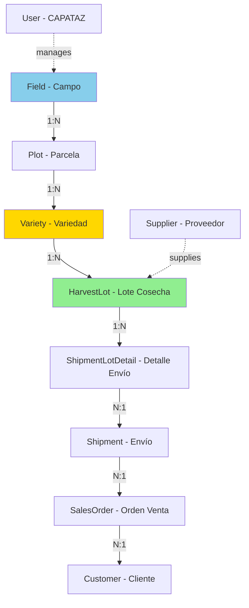
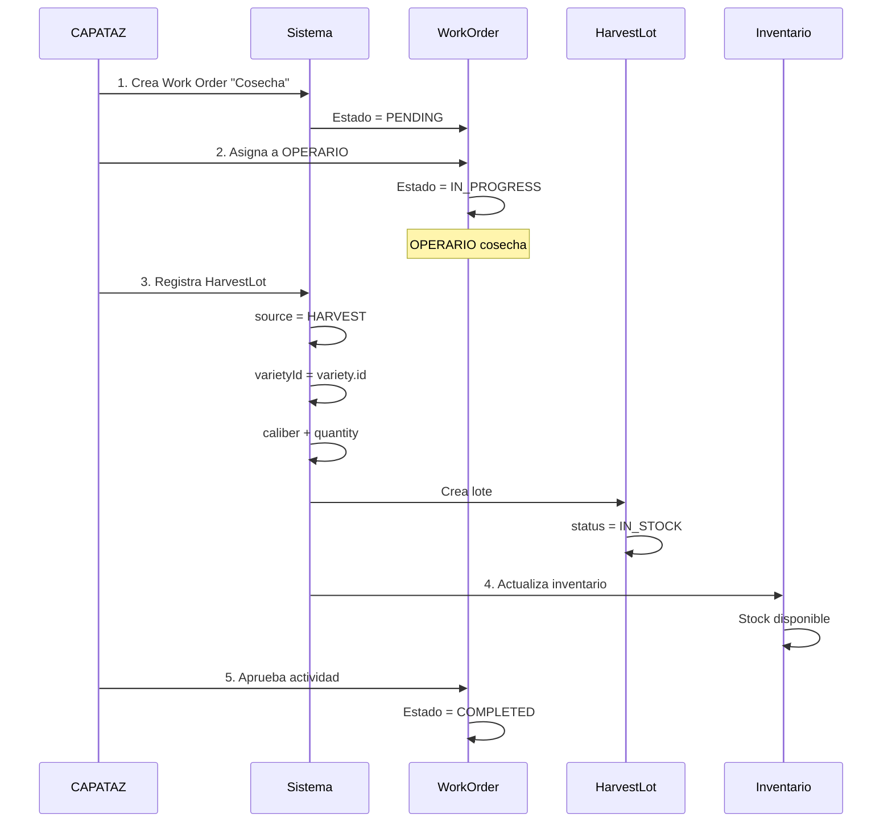

# 🌳 Módulo de Producción

## Índice
- [Descripción General](#descripción-general)
- [Entidades del Módulo](#entidades-del-módulo)
- [Flujo de Producción](#flujo-de-producción)
- [Componentes](#componentes)
- [Endpoints](#endpoints)
- [Casos de Uso](#casos-de-uso)
- [Reglas de Negocio](#reglas-de-negocio)

---

## Descripción General

El módulo de producción gestiona toda la estructura productiva de la empresa: campos, parcelas, variedades de nogales, y los lotes de cosecha con trazabilidad completa desde el árbol hasta el stock.

### Características Principales

- ✅ **Gestión de Campos** - Campos productivos con CAPATAZ asignado
- ✅ **Parcelas** - División de campos en unidades productivas
- ✅ **Variedades** - Variedades de nogales plantadas por parcela
- ✅ **Lotes de Cosecha** - Registro de cosechas con calibre y trazabilidad
- ✅ **Jerarquía Completa** - Field → Plot → Variety → HarvestLot
- ✅ **Control de Acceso** - CAPATAZ solo ve sus campos
- ✅ **Doble Fuente** - Cosecha propia + Compra a proveedores

### Estado

🟢 **Implementado y Funcional**

---

## Entidades del Módulo

### 1. Field (Campo)

Representa un campo productivo de la empresa.

| Campo | Tipo | Descripción | Constraints |
|-------|------|-------------|-------------|
| `id` | uuid | Identificador único | PK |
| `name` | varchar | Nombre del campo | NOT NULL, UNIQUE |
| `location` | varchar | Ubicación geográfica | Optional |
| `totalArea` | decimal(10,2) | Superficie total (ha) | NOT NULL, > 0 |
| `managerId` | uuid | CAPATAZ responsable | FK → User (role: CAPATAZ) |
| `createdAt` | timestamp | Fecha de creación | Auto |
| `updatedAt` | timestamp | Última actualización | Auto |
| `deletedAt` | timestamp | Eliminación lógica | Nullable |

**Relaciones:**
- **N:1** → User (manager) - CAPATAZ encargado
- **1:N** → Plot (plots) - Parcelas del campo
- **1:N** → WorkOrder (workOrders) - Órdenes de trabajo

**Constraint:**
```typescript
@Check(`"totalArea" > 0`)
```

---

### 2. Plot (Parcela)

División de un campo en unidades productivas.

| Campo | Tipo | Descripción | Constraints |
|-------|------|-------------|-------------|
| `id` | uuid | Identificador único | PK |
| `fieldId` | uuid | Campo padre | FK → Field, NOT NULL |
| `plotNumber` | varchar | Número de parcela | NOT NULL |
| `area` | decimal(10,2) | Superficie (ha) | NOT NULL, > 0 |
| `soilType` | varchar | Tipo de suelo | Optional |
| `irrigationSystem` | varchar | Sistema de riego | Optional |
| `plantingDate` | date | Fecha de plantación | Optional |
| `notes` | text | Observaciones | Optional |
| `createdAt` | timestamp | Fecha de creación | Auto |
| `updatedAt` | timestamp | Última actualización | Auto |
| `deletedAt` | timestamp | Eliminación lógica | Nullable |

**Relaciones:**
- **N:1** → Field (field)
- **1:N** → Variety (varieties) - Variedades plantadas
- **1:N** → Activity (activities) - Actividades realizadas

**Constraint Único:**
```typescript
@Unique(['fieldId', 'plotNumber'])
// No puede haber dos parcelas con el mismo número en un campo
```

---

### 3. Variety (Variedad de Nogal)

Variedad de nogal plantada en una parcela.

| Campo | Tipo | Descripción | Constraints |
|-------|------|-------------|-------------|
| `id` | uuid | Identificador único | PK |
| `plotId` | uuid | Parcela | FK → Plot, NOT NULL |
| `varietyName` | varchar | Nombre de la variedad | NOT NULL |
| `treeCount` | integer | Cantidad de árboles | NOT NULL, > 0 |
| `plantingDate` | date | Fecha de plantación | Optional |
| `expectedYield` | decimal(10,2) | Rendimiento esperado (kg/ha) | Optional |
| `notes` | text | Observaciones | Optional |
| `createdAt` | timestamp | Fecha de creación | Auto |
| `updatedAt` | timestamp | Última actualización | Auto |
| `deletedAt` | timestamp | Eliminación lógica | Nullable |

**Variedades Comunes:**
- `CHANDLER` - Nuez de alta calidad
- `SERR` - Maduración temprana
- `HOWARD` - Resistente a enfermedades
- `VINA` - Alta producción

**Relaciones:**
- **N:1** → Plot (plot)
- **1:N** → HarvestLot (harvestLots) - Lotes cosechados

**Constraint Único:**
```typescript
@Unique(['plotId', 'varietyName'])
// No puede haber dos plantaciones de la misma variedad en una parcela
```

---

### 4. HarvestLot (Lote de Cosecha)

Lote de nueces cosechadas o compradas.

| Campo | Tipo | Descripción | Constraints |
|-------|------|-------------|-------------|
| `id` | uuid | Identificador único | PK |
| `source` | enum | Origen del lote | HARVEST \| PURCHASE, NOT NULL |
| `varietyId` | uuid | Variedad (si source=HARVEST) | FK → Variety, Nullable |
| `supplierId` | uuid | Proveedor (si source=PURCHASE) | FK → Supplier, Nullable |
| `caliber` | enum | Calibre de nuez | WalnutCaliber, NOT NULL |
| `quantity` | decimal(10,2) | Cantidad (kg) | NOT NULL, > 0 |
| `harvestDate` | date | Fecha de cosecha/compra | NOT NULL |
| `status` | enum | Estado del lote | IN_STOCK \| PROCESSING \| SOLD, DEFAULT: IN_STOCK |
| `notes` | text | Observaciones | Optional |
| `createdAt` | timestamp | Fecha de creación | Auto |
| `updatedAt` | timestamp | Última actualización | Auto |
| `deletedAt` | timestamp | Eliminación lógica | Nullable |

**Enums:**

**HarvestLotSource:**
- `HARVEST`: Cosecha propia de los campos
- `PURCHASE`: Compra a proveedores

**HarvestLotStatus:**
- `IN_STOCK`: En inventario disponible
- `PROCESSING`: En procesamiento
- `SOLD`: Vendido/despachado

**WalnutCaliber:**
- `CHANDLER`
- `SERR`
- `HOWARD`
- `VINA`
- `OTHER`

**Relaciones:**
- **N:1** → Variety (variety) - si source=HARVEST
- **N:1** → Supplier (supplier) - si source=PURCHASE
- **1:N** → ShipmentLotDetail (shipmentDetails) - Envíos asociados

**Constraints:**
```typescript
@Check(`
  (source = 'HARVEST' AND "varietyId" IS NOT NULL AND "supplierId" IS NULL) OR
  (source = 'PURCHASE' AND "supplierId" IS NOT NULL AND "varietyId" IS NULL)
`)
// Si es HARVEST debe tener varietyId
// Si es PURCHASE debe tener supplierId
```

---

## Flujo de Producción

### Jerarquía Completa



---

### Flujo de Cosecha



---

## Componentes

### 1. Field Controller

```typescript
class FieldController {
  /**
   * GET /fields
   * Listar campos
   * ADMIN ve todos, CAPATAZ solo sus campos
   */
  async getAll(req: Request, res: Response): Promise<void>
  
  /**
   * GET /fields/:id
   * Obtener campo con parcelas y variedades
   */
  async getById(req: Request, res: Response): Promise<void>
  
  /**
   * POST /fields
   * Crear nuevo campo
   * Solo ADMIN
   */
  async create(req: Request, res: Response): Promise<void>
  
  /**
   * PUT /fields/:id
   * Actualizar campo
   * Solo ADMIN
   */
  async update(req: Request, res: Response): Promise<void>
  
  /**
   * DELETE /fields/:id
   * Eliminar campo (soft delete)
   * Solo ADMIN
   */
  async delete(req: Request, res: Response): Promise<void>
}
```

---

### 2. Plot Controller

```typescript
class PlotController {
  /**
   * GET /plots
   * Listar parcelas
   * Query: ?fieldId=uuid
   */
  async getAll(req: Request, res: Response): Promise<void>
  
  /**
   * GET /plots/:id
   * Obtener parcela con variedades
   */
  async getById(req: Request, res: Response): Promise<void>
  
  /**
   * POST /plots
   * Crear nueva parcela
   * Solo ADMIN y CAPATAZ (del campo)
   */
  async create(req: Request, res: Response): Promise<void>
  
  /**
   * PUT /plots/:id
   * Actualizar parcela
   * Solo ADMIN y CAPATAZ (del campo)
   */
  async update(req: Request, res: Response): Promise<void>
  
  /**
   * DELETE /plots/:id
   * Eliminar parcela (soft delete)
   * Solo ADMIN
   */
  async delete(req: Request, res: Response): Promise<void>
}
```

---

### 3. Variety Controller

```typescript
class VarietyController {
  /**
   * GET /varieties
   * Listar variedades
   * Query: ?plotId=uuid&varietyName=CHANDLER
   */
  async getAll(req: Request, res: Response): Promise<void>
  
  /**
   * GET /varieties/:id
   * Obtener variedad con lotes de cosecha
   */
  async getById(req: Request, res: Response): Promise<void>
  
  /**
   * POST /varieties
   * Registrar variedad en parcela
   * Solo ADMIN y CAPATAZ
   */
  async create(req: Request, res: Response): Promise<void>
  
  /**
   * PUT /varieties/:id
   * Actualizar variedad
   * Solo ADMIN y CAPATAZ
   */
  async update(req: Request, res: Response): Promise<void>
  
  /**
   * DELETE /varieties/:id
   * Eliminar variedad (soft delete)
   * Solo ADMIN
   */
  async delete(req: Request, res: Response): Promise<void>
}
```

---

### 4. Harvest Lot Controller

```typescript
class HarvestLotController {
  /**
   * GET /harvest-lots
   * Listar lotes
   * Query: ?source=HARVEST&status=IN_STOCK&caliber=CHANDLER
   */
  async getAll(req: Request, res: Response): Promise<void>
  
  /**
   * GET /harvest-lots/:id
   * Obtener lote con trazabilidad completa
   */
  async getById(req: Request, res: Response): Promise<void>
  
  /**
   * POST /harvest-lots
   * Registrar lote de cosecha
   * Solo ADMIN y CAPATAZ
   */
  async create(req: Request, res: Response): Promise<void>
  
  /**
   * PUT /harvest-lots/:id
   * Actualizar lote (status, quantity)
   * Solo ADMIN
   */
  async update(req: Request, res: Response): Promise<void>
  
  /**
   * DELETE /harvest-lots/:id
   * Eliminar lote (soft delete)
   * Solo ADMIN
   */
  async delete(req: Request, res: Response): Promise<void>
  
  /**
   * GET /harvest-lots/stock
   * Consultar stock disponible por calibre
   */
  async getStock(req: Request, res: Response): Promise<void>
}
```

---

## Endpoints

### 🌾 Fields

#### GET /fields

Listar todos los campos.

**Autorización:** 
- ADMIN: ve todos
- CAPATAZ: solo sus campos (`managerId = user.id`)

**Request:**
```
GET /fields
Authorization: Bearer {token}
```

**Response (200) - ADMIN:**
```json
[
  {
    "id": "field-uuid-1",
    "name": "Campo Norte",
    "location": "Mendoza - Luján de Cuyo",
    "totalArea": 50.00,
    "manager": {
      "id": "capataz-uuid-1",
      "name": "Juan",
      "lastName": "Pérez"
    },
    "plots": [
      {
        "id": "plot-uuid-1",
        "plotNumber": "N-01",
        "area": 10.00
      }
    ],
    "createdAt": "2025-01-01T00:00:00.000Z"
  }
]
```

---

#### POST /fields

Crear nuevo campo.

**Autorización:** Solo ADMIN

**Request:**
```json
POST /fields
Authorization: Bearer {admin-token}
Content-Type: application/json

{
  "name": "Campo Sur",
  "location": "Mendoza - San Rafael",
  "totalArea": 30.50,
  "managerId": "capataz-uuid-2"
}
```

**Validaciones:**
- `name` único
- `totalArea` > 0
- `managerId` debe ser un usuario con role: CAPATAZ

**Response (201):**
```json
{
  "id": "new-field-uuid",
  "name": "Campo Sur",
  "location": "Mendoza - San Rafael",
  "totalArea": 30.50,
  "manager": {
    "id": "capataz-uuid-2",
    "name": "Carlos",
    "lastName": "Rodríguez"
  },
  "createdAt": "2025-01-10T00:00:00.000Z"
}
```

---

### 📐 Plots

#### GET /plots

Listar parcelas con filtros.

**Autorización:** Autenticado

**Query Parameters:**
- `fieldId` (uuid): Filtrar por campo

**Request:**
```
GET /plots?fieldId=field-uuid-1
Authorization: Bearer {token}
```

**Response (200):**
```json
[
  {
    "id": "plot-uuid-1",
    "field": {
      "id": "field-uuid-1",
      "name": "Campo Norte"
    },
    "plotNumber": "N-01",
    "area": 10.00,
    "soilType": "Franco-arcilloso",
    "irrigationSystem": "Goteo",
    "plantingDate": "2020-05-15",
    "varieties": [
      {
        "id": "variety-uuid-1",
        "varietyName": "CHANDLER",
        "treeCount": 250
      }
    ],
    "createdAt": "2025-01-01T00:00:00.000Z"
  }
]
```

---

#### POST /plots

Crear nueva parcela.

**Autorización:** ADMIN o CAPATAZ (del campo)

**Request:**
```json
POST /plots
Authorization: Bearer {token}
Content-Type: application/json

{
  "fieldId": "field-uuid-1",
  "plotNumber": "N-02",
  "area": 12.50,
  "soilType": "Franco-arenoso",
  "irrigationSystem": "Aspersión",
  "plantingDate": "2021-03-20",
  "notes": "Suelo con buen drenaje"
}
```

**Validaciones:**
- `fieldId` debe existir
- `plotNumber` único dentro del campo
- `area` > 0
- CAPATAZ solo puede crear en sus campos

**Response (201):**
```json
{
  "id": "new-plot-uuid",
  "fieldId": "field-uuid-1",
  "plotNumber": "N-02",
  "area": 12.50,
  "soilType": "Franco-arenoso",
  "irrigationSystem": "Aspersión",
  "plantingDate": "2021-03-20",
  "notes": "Suelo con buen drenaje",
  "createdAt": "2025-01-10T00:00:00.000Z"
}
```

---

### 🌳 Varieties

#### GET /varieties

Listar variedades con filtros.

**Autorización:** Autenticado

**Query Parameters:**
- `plotId` (uuid): Filtrar por parcela
- `varietyName` (string): Filtrar por variedad

**Request:**
```
GET /varieties?plotId=plot-uuid-1&varietyName=CHANDLER
Authorization: Bearer {token}
```

**Response (200):**
```json
[
  {
    "id": "variety-uuid-1",
    "plot": {
      "id": "plot-uuid-1",
      "plotNumber": "N-01",
      "field": {
        "name": "Campo Norte"
      }
    },
    "varietyName": "CHANDLER",
    "treeCount": 250,
    "plantingDate": "2020-05-15",
    "expectedYield": 2000.00,
    "harvestLots": [
      {
        "id": "hl-uuid-1",
        "harvestDate": "2025-03-15",
        "quantity": 1800.00,
        "caliber": "CHANDLER"
      }
    ],
    "createdAt": "2020-05-20T00:00:00.000Z"
  }
]
```

---

#### POST /varieties

Registrar variedad en parcela.

**Autorización:** ADMIN o CAPATAZ

**Request:**
```json
POST /varieties
Authorization: Bearer {token}
Content-Type: application/json

{
  "plotId": "plot-uuid-1",
  "varietyName": "SERR",
  "treeCount": 180,
  "plantingDate": "2020-06-10",
  "expectedYield": 1500.00,
  "notes": "Variedad de maduración temprana"
}
```

**Validaciones:**
- `plotId` debe existir
- `varietyName` no duplicado en la misma parcela
- `treeCount` > 0

**Response (201):**
```json
{
  "id": "new-variety-uuid",
  "plotId": "plot-uuid-1",
  "varietyName": "SERR",
  "treeCount": 180,
  "plantingDate": "2020-06-10",
  "expectedYield": 1500.00,
  "notes": "Variedad de maduración temprana",
  "createdAt": "2025-01-10T00:00:00.000Z"
}
```

---

### 🌰 Harvest Lots

#### GET /harvest-lots

Listar lotes de cosecha con filtros.

**Autorización:** Autenticado

**Query Parameters:**
- `source` (enum): HARVEST | PURCHASE
- `status` (enum): IN_STOCK | PROCESSING | SOLD
- `caliber` (enum): CHANDLER | SERR | HOWARD | VINA | OTHER
- `varietyId` (uuid): Filtrar por variedad
- `supplierId` (uuid): Filtrar por proveedor

**Request:**
```
GET /harvest-lots?source=HARVEST&status=IN_STOCK&caliber=CHANDLER
Authorization: Bearer {token}
```

**Response (200):**
```json
[
  {
    "id": "hl-uuid-1",
    "source": "HARVEST",
    "variety": {
      "id": "variety-uuid-1",
      "varietyName": "CHANDLER",
      "plot": {
        "plotNumber": "N-01",
        "field": {
          "name": "Campo Norte"
        }
      }
    },
    "caliber": "CHANDLER",
    "quantity": 1800.00,
    "harvestDate": "2025-03-15",
    "status": "IN_STOCK",
    "notes": "Cosecha de excelente calidad",
    "createdAt": "2025-03-15T14:00:00.000Z"
  }
]
```

---

#### POST /harvest-lots

Registrar nuevo lote de cosecha.

**Autorización:** ADMIN o CAPATAZ

**Request (Cosecha Propia):**
```json
POST /harvest-lots
Authorization: Bearer {token}
Content-Type: application/json

{
  "source": "HARVEST",
  "varietyId": "variety-uuid-1",
  "caliber": "CHANDLER",
  "quantity": 1800.00,
  "harvestDate": "2025-03-15",
  "notes": "Cosecha de excelente calidad"
}
```

**Request (Compra - automático desde GoodsReceipt):**
```json
{
  "source": "PURCHASE",
  "supplierId": "supplier-uuid-1",
  "caliber": "SERR",
  "quantity": 500.00,
  "harvestDate": "2025-01-20"
}
```

**Validaciones:**
- Si `source = HARVEST`: `varietyId` requerido, `supplierId` null
- Si `source = PURCHASE`: `supplierId` requerido, `varietyId` null
- `quantity` > 0
- `caliber` válido

**Response (201):**
```json
{
  "id": "new-hl-uuid",
  "source": "HARVEST",
  "varietyId": "variety-uuid-1",
  "caliber": "CHANDLER",
  "quantity": 1800.00,
  "harvestDate": "2025-03-15",
  "status": "IN_STOCK",
  "notes": "Cosecha de excelente calidad",
  "createdAt": "2025-03-15T14:00:00.000Z"
}
```

---

#### GET /harvest-lots/stock

Obtener stock disponible por calibre.

**Autorización:** Autenticado

**Request:**
```
GET /harvest-lots/stock
Authorization: Bearer {token}
```

**Response (200):**
```json
{
  "total": 5600.00,
  "byCaliber": [
    {
      "caliber": "CHANDLER",
      "quantity": 2500.00,
      "bySource": {
        "HARVEST": 1800.00,
        "PURCHASE": 700.00
      }
    },
    {
      "caliber": "SERR",
      "quantity": 1800.00,
      "bySource": {
        "HARVEST": 1300.00,
        "PURCHASE": 500.00
      }
    },
    {
      "caliber": "HOWARD",
      "quantity": 1300.00,
      "bySource": {
        "HARVEST": 1300.00,
        "PURCHASE": 0.00
      }
    }
  ],
  "lastUpdated": "2025-01-15T10:00:00.000Z"
}
```

---

## Casos de Uso

### Caso 1: ADMIN Crea Campo y Asigna CAPATAZ

**Actor:** ADMIN

**Flujo:**
1. ADMIN crea nuevo campo productivo
2. Asigna CAPATAZ responsable
3. CAPATAZ ahora puede gestionar ese campo

**Código:**
```typescript
const createFieldWithManager = async () => {
  // Buscar CAPATAZ disponible
  const capataz = await userService.getByEmail('capataz.sur@tejadahnos.com');
  
  // Crear campo
  const field = await fieldService.create({
    name: 'Campo Sur',
    location: 'Mendoza - San Rafael',
    totalArea: 30.50,
    managerId: capataz.id
  });
  
  // CAPATAZ puede ver el campo
  const fieldsForCapataz = await fieldService.getByManager(capataz.id);
  // [{ name: 'Campo Sur', ... }]
};
```

---

### Caso 2: CAPATAZ Divide Campo en Parcelas

**Actor:** CAPATAZ

**Flujo:**
1. CAPATAZ accede a su campo asignado
2. Crea parcelas según planificación agronómica
3. Registra características de cada parcela

**Código:**
```typescript
const createPlots = async (fieldId: string) => {
  // Parcela 1
  await plotService.create({
    fieldId,
    plotNumber: 'S-01',
    area: 10.00,
    soilType: 'Franco-arcilloso',
    irrigationSystem: 'Goteo',
    plantingDate: '2020-05-15'
  });
  
  // Parcela 2
  await plotService.create({
    fieldId,
    plotNumber: 'S-02',
    area: 12.50,
    soilType: 'Franco-arenoso',
    irrigationSystem: 'Aspersión',
    plantingDate: '2021-03-20'
  });
  
  // Parcela 3
  await plotService.create({
    fieldId,
    plotNumber: 'S-03',
    area: 8.00,
    soilType: 'Arcilloso',
    irrigationSystem: 'Goteo',
    plantingDate: '2019-11-10'
  });
};
```

---

### Caso 3: Registrar Variedades Plantadas

**Actor:** CAPATAZ

**Flujo:**
1. Para cada parcela, registra variedad plantada
2. Indica cantidad de árboles
3. Registra fecha de plantación
4. Estima rendimiento esperado

**Código:**
```typescript
const registerVarieties = async (plotId: string) => {
  // CHANDLER en parcela S-01
  await varietyService.create({
    plotId,
    varietyName: 'CHANDLER',
    treeCount: 250,
    plantingDate: '2020-06-01',
    expectedYield: 2000.00,
    notes: 'Variedad principal de alta calidad'
  });
  
  // SERR en la misma parcela (combinación)
  await varietyService.create({
    plotId,
    varietyName: 'SERR',
    treeCount: 50,
    plantingDate: '2020-06-15',
    expectedYield: 400.00,
    notes: 'Polinizadora'
  });
};
```

---

### Caso 4: Registrar Cosecha

**Actor:** CAPATAZ

**Flujo:**
1. Se realiza la cosecha en parcela
2. CAPATAZ pesa la producción por calibre
3. Registra lote de cosecha
4. Stock se actualiza automáticamente

**Código:**
```typescript
const registerHarvest = async (varietyId: string) => {
  // Cosecha de CHANDLER
  const harvestLot = await harvestLotService.create({
    source: HarvestLotSource.HARVEST,
    varietyId,
    caliber: WalnutCaliber.CHANDLER,
    quantity: 1800.00, // kg
    harvestDate: '2025-03-15',
    notes: 'Cosecha de excelente calidad, sin merma'
  });
  
  // harvestLot.status === 'IN_STOCK'
  
  // Consultar stock actualizado
  const stock = await harvestLotService.getStock();
  // { total: 1800.00, byCaliber: [{ caliber: 'CHANDLER', quantity: 1800.00 }] }
};
```

---

### Caso 5: Trazabilidad Completa de un Lote

**Actor:** Cualquier usuario autenticado

**Flujo:**
1. Usuario busca un lote específico
2. Sistema muestra origen completo:
   - Si HARVEST: Campo → Parcela → Variedad
   - Si PURCHASE: Proveedor + Goods Receipt

**Código:**
```typescript
const getFullTraceability = async (harvestLotId: string) => {
  const lot = await harvestLotService.getById(harvestLotId, {
    relations: [
      'variety',
      'variety.plot',
      'variety.plot.field',
      'variety.plot.field.manager',
      'supplier',
      'shipmentDetails',
      'shipmentDetails.shipment',
      'shipmentDetails.shipment.salesOrder',
      'shipmentDetails.shipment.salesOrder.customer'
    ]
  });
  
  if (lot.source === 'HARVEST') {
    console.log(`
      Origen: Cosecha Propia
      Campo: ${lot.variety.plot.field.name}
      Capataz: ${lot.variety.plot.field.manager.name}
      Parcela: ${lot.variety.plot.plotNumber}
      Variedad: ${lot.variety.varietyName}
      Calibre: ${lot.caliber}
      Cantidad: ${lot.quantity} kg
      Fecha: ${lot.harvestDate}
    `);
  } else {
    console.log(`
      Origen: Compra
      Proveedor: ${lot.supplier.name}
      Calibre: ${lot.caliber}
      Cantidad: ${lot.quantity} kg
      Fecha: ${lot.harvestDate}
    `);
  }
};
```

---

## Reglas de Negocio

### 1. Control de Acceso por CAPATAZ

```typescript
/**
 * CAPATAZ solo puede gestionar sus campos asignados
 */

const getFieldsForUser = async (user: User): Promise<Field[]> => {
  if (user.role === UserRole.ADMIN) {
    // ADMIN ve todos
    return await fieldRepo.find({
      relations: ['manager', 'plots']
    });
  }
  
  if (user.role === UserRole.CAPATAZ) {
    // CAPATAZ solo ve sus campos
    return await fieldRepo.find({
      where: { managerId: user.id },
      relations: ['plots']
    });
  }
  
  // OPERARIO no gestiona campos directamente
  return [];
};
```

---

### 2. Validación de Área

```typescript
/**
 * La suma de áreas de parcelas no puede exceder el área total del campo
 */

const validatePlotArea = async (plot: Plot): Promise<void> => {
  const field = await fieldRepo.findOne({
    where: { id: plot.fieldId },
    relations: ['plots']
  });
  
  if (!field) {
    throw new NotFoundError('Campo no encontrado');
  }
  
  const totalPlotArea = field.plots
    .filter(p => p.id !== plot.id) // Excluir la parcela actual si es update
    .reduce((sum, p) => sum + Number(p.area), 0);
  
  const newTotal = totalPlotArea + Number(plot.area);
  
  if (newTotal > Number(field.totalArea)) {
    throw new ValidationError(
      `El área total de parcelas (${newTotal} ha) excede el área del campo (${field.totalArea} ha)`
    );
  }
};
```

---

### 3. Actualización de Stock

```typescript
/**
 * Al crear HarvestLot, actualizar stock disponible
 * Al vender (ShipmentLotDetail), reducir stock
 */

// Al crear lote
const afterCreateHarvestLot = async (lot: HarvestLot) => {
  lot.status = HarvestLotStatus.IN_STOCK;
  // Stock disponible aumenta automáticamente
};

// Al vender
const afterCreateShipmentDetail = async (
  detail: ShipmentLotDetail,
  lot: HarvestLot
) => {
  // Reducir cantidad del lote
  lot.quantity -= detail.quantity;
  
  if (lot.quantity === 0) {
    lot.status = HarvestLotStatus.SOLD;
  }
  
  await harvestLotRepo.save(lot);
};
```

---

### 4. Calibre y Variedad

```typescript
/**
 * El calibre del lote debe corresponder con la variedad
 * (normalmente son iguales, pero puede haber mezclas)
 */

const validateCaliberForVariety = (variety: Variety, caliber: WalnutCaliber) => {
  // Por ahora permitimos cualquier calibre
  // En el futuro, podríamos validar:
  // - CHANDLER variety debe producir calibre CHANDLER
  // - etc.
  
  return true;
};
```

---

## Reportes y Consultas

### Stock Total por Calibre

```typescript
const getStockByCaliber = async (): Promise<any[]> => {
  return await harvestLotRepo
    .createQueryBuilder('hl')
    .select('hl.caliber', 'caliber')
    .addSelect('SUM(hl.quantity)', 'totalQuantity')
    .addSelect('COUNT(*)', 'lotCount')
    .where('hl.status = :status', { status: HarvestLotStatus.IN_STOCK })
    .groupBy('hl.caliber')
    .orderBy('totalQuantity', 'DESC')
    .getRawMany();
};

// Result:
// [
//   { caliber: 'CHANDLER', totalQuantity: 2500, lotCount: 5 },
//   { caliber: 'SERR', totalQuantity: 1800, lotCount: 3 }
// ]
```

---

### Producción por Campo

```typescript
const getProductionByField = async (
  startDate: Date,
  endDate: Date
): Promise<any[]> => {
  return await harvestLotRepo
    .createQueryBuilder('hl')
    .innerJoin('hl.variety', 'variety')
    .innerJoin('variety.plot', 'plot')
    .innerJoin('plot.field', 'field')
    .select('field.name', 'fieldName')
    .addSelect('SUM(hl.quantity)', 'totalProduction')
    .addSelect('COUNT(DISTINCT hl.caliber)', 'caliberCount')
    .where('hl.source = :source', { source: HarvestLotSource.HARVEST })
    .andWhere('hl.harvestDate BETWEEN :startDate AND :endDate', {
      startDate,
      endDate
    })
    .groupBy('field.id, field.name')
    .orderBy('totalProduction', 'DESC')
    .getRawMany();
};
```

---

### Rendimiento por Variedad

```typescript
const getYieldByVariety = async (): Promise<any[]> => {
  return await harvestLotRepo
    .createQueryBuilder('hl')
    .innerJoin('hl.variety', 'variety')
    .innerJoin('variety.plot', 'plot')
    .select('variety.varietyName', 'varietyName')
    .addSelect('SUM(hl.quantity)', 'totalHarvested')
    .addSelect('SUM(plot.area)', 'totalArea')
    .addSelect('SUM(hl.quantity) / SUM(plot.area)', 'yieldPerHa')
    .where('hl.source = :source', { source: HarvestLotSource.HARVEST })
    .groupBy('variety.varietyName')
    .orderBy('yieldPerHa', 'DESC')
    .getRawMany();
};

// Result:
// [
//   { varietyName: 'CHANDLER', totalHarvested: 5000, totalArea: 25, yieldPerHa: 200 },
//   { varietyName: 'SERR', totalHarvested: 3000, totalArea: 20, yieldPerHa: 150 }
// ]
```

---

### Lotes Disponibles para Venta

```typescript
const getAvailableLotsForSale = async (): Promise<HarvestLot[]> => {
  return await harvestLotRepo.find({
    where: { 
      status: HarvestLotStatus.IN_STOCK,
      quantity: MoreThan(0)
    },
    relations: ['variety', 'supplier'],
    order: { harvestDate: 'ASC' } // FIFO
  });
};
```

---

## Mejoras Futuras

- [ ] Mapas de campos con geolocalización
- [ ] Fotos de parcelas y cultivos
- [ ] Análisis de suelo por parcela
- [ ] Predicción de rendimiento con IA
- [ ] Control de plagas y enfermedades
- [ ] Historial climático por campo
- [ ] Optimización de riego
- [ ] Dashboard de producción en tiempo real
- [ ] Exportación de reportes (PDF, Excel)
- [ ] Integración con sensores IoT

---

**Documentación relacionada:**
- [03-COMPRAS.md](./03-COMPRAS.md) - Compra de nueces (HarvestLot source=PURCHASE)
- [05-OPERACIONES.md](./05-OPERACIONES.md) - Work Orders y Activities en campos
- [06-VENTAS.md](./06-VENTAS.md) - Venta de HarvestLots
- [07-INVENTARIO.md](./07-INVENTARIO.md) - Gestión de stock
- [FLUJOS/flujo-produccion.mmd](../FLUJOS/flujo-produccion.mmd) - Diagrama de flujo completo
- [API: endpoints-fields.md](../API/endpoints-fields.md)
- [API: endpoints-plots.md](../API/endpoints-plots.md)
- [API: endpoints-varieties.md](../API/endpoints-varieties.md)
- [API: endpoints-harvest-lots.md](../API/endpoints-harvest-lots.md)
