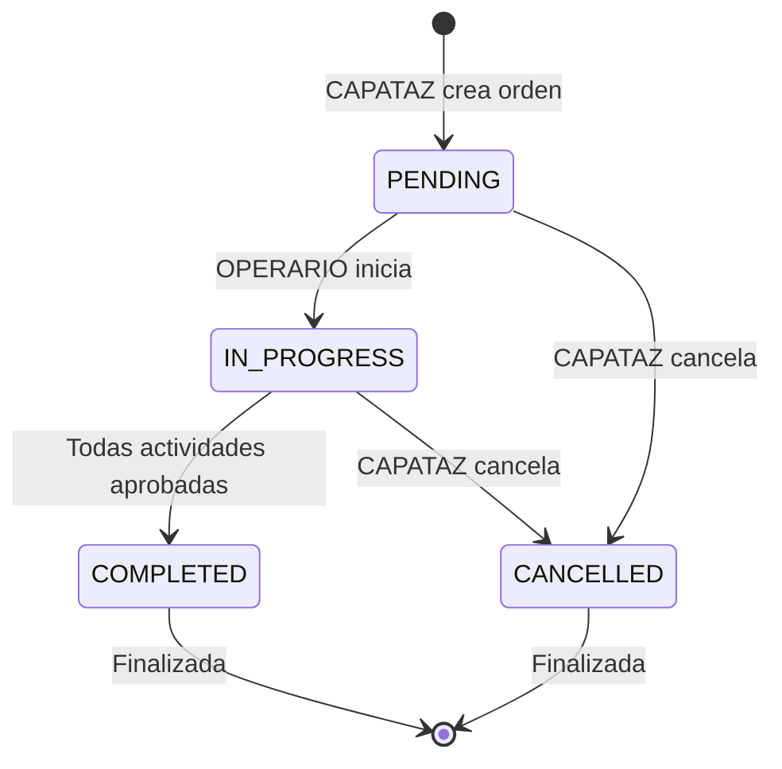
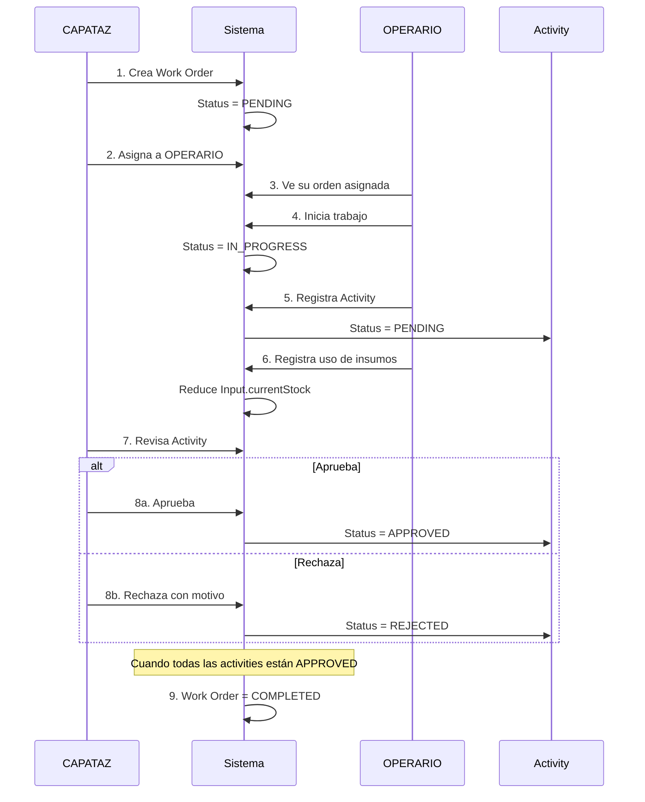

# 🛠️ Módulo de Operaciones

## Índice
- [Descripción General](#descripción-general)
- [Entidades del Módulo](#entidades-del-módulo)
- [Flujo de Operaciones](#flujo-de-operaciones)
- [Componentes](#componentes)
- [Endpoints](#endpoints)
- [Casos de Uso](#casos-de-uso)
- [Reglas de Negocio](#reglas-de-negocio)

---

## Descripción General

El módulo de operaciones gestiona todas las tareas de campo: órdenes de trabajo (Work Orders), actividades realizadas, uso de insumos, y aprobación de tareas completadas.

### Características Principales

- ✅ **Órdenes de Trabajo** - Creación y asignación a OPERARIO
- ✅ **Actividades** - Registro de tareas realizadas
- ✅ **Uso de Insumos** - Registro de aplicación de productos
- ✅ **Workflow de Aprobación** - CAPATAZ aprueba actividades
- ✅ **Trazabilidad** - Qué se hizo, quién, cuándo, dónde
- ✅ **Control de Costos** - Horas trabajadas + insumos usados

### Estado

🟢 **Implementado y Funcional**

---

## Entidades del Módulo

### 1. WorkOrder (Orden de Trabajo)

Orden de trabajo asignada a un operario para realizar tareas en un campo.

| Campo | Tipo | Descripción | Constraints |
|-------|------|-------------|-------------|
| `id` | uuid | Identificador único | PK |
| `title` | varchar | Título de la orden | NOT NULL |
| `description` | text | Descripción detallada | Optional |
| `fieldId` | uuid | Campo donde se trabaja | FK → Field, NOT NULL |
| `assignedToId` | uuid | OPERARIO asignado | FK → User (role: OPERARIO), NOT NULL |
| `startDate` | date | Fecha de inicio | NOT NULL |
| `endDate` | date | Fecha de fin estimada | Optional |
| `status` | enum | Estado de la orden | PENDING \| IN_PROGRESS \| COMPLETED \| CANCELLED |
| `createdAt` | timestamp | Fecha de creación | Auto |
| `updatedAt` | timestamp | Última actualización | Auto |
| `deletedAt` | timestamp | Eliminación lógica | Nullable |

**Estados Posibles:**
- `PENDING`: Creada, no iniciada
- `IN_PROGRESS`: En ejecución
- `COMPLETED`: Finalizada y aprobada
- `CANCELLED`: Cancelada

**Relaciones:**
- **N:1** → Field (field) - Campo de trabajo
- **N:1** → User (assignedTo) - OPERARIO asignado
- **1:N** → Activity (activities) - Actividades realizadas

---

### 2. Activity (Actividad)

Registro de una actividad realizada en el marco de una orden de trabajo.

| Campo | Tipo | Descripción | Constraints |
|-------|------|-------------|-------------|
| `id` | uuid | Identificador único | PK |
| `workOrderId` | uuid | Orden de trabajo | FK → WorkOrder, NOT NULL |
| `plotId` | uuid | Parcela donde se trabajó | FK → Plot, NOT NULL |
| `activityType` | enum | Tipo de actividad | ActivityType, NOT NULL |
| `activityDate` | date | Fecha de ejecución | NOT NULL |
| `startTime` | time | Hora de inicio | Optional |
| `endTime` | time | Hora de fin | Optional |
| `hoursWorked` | decimal(5,2) | Horas trabajadas | CALCULATED o manual |
| `description` | text | Descripción de lo realizado | Optional |
| `status` | enum | Estado de la actividad | PENDING \| APPROVED \| REJECTED |
| `approvedBy` | uuid | CAPATAZ que aprobó | FK → User (role: CAPATAZ), Nullable |
| `approvedAt` | timestamp | Fecha de aprobación | Nullable |
| `rejectionReason` | text | Motivo de rechazo | Nullable |
| `createdAt` | timestamp | Fecha de creación | Auto |
| `updatedAt` | timestamp | Última actualización | Auto |
| `deletedAt` | timestamp | Eliminación lógica | Nullable |

**Enums:**

**ActivityType:**
- `PRUNING`: Poda
- `IRRIGATION`: Riego
- `FERTILIZATION`: Fertilización
- `PEST_CONTROL`: Control de plagas
- `HARVEST`: Cosecha
- `PLANTING`: Plantación
- `MAINTENANCE`: Mantenimiento general
- `OTHER`: Otro

**ActivityStatus:**
- `PENDING`: Registrada, pendiente de aprobación
- `APPROVED`: Aprobada por CAPATAZ
- `REJECTED`: Rechazada por CAPATAZ

**Relaciones:**
- **N:1** → WorkOrder (workOrder)
- **N:1** → Plot (plot)
- **N:1** → User (approvedByUser)
- **1:N** → InputUsage (inputUsages) - Insumos usados

---

### 3. Input (Insumo)

Productos usados en actividades (fertilizantes, pesticidas, etc.).

| Campo | Tipo | Descripción | Constraints |
|-------|------|-------------|-------------|
| `id` | uuid | Identificador único | PK |
| `name` | varchar | Nombre del insumo | NOT NULL, UNIQUE |
| `description` | text | Descripción | Optional |
| `unit` | enum | Unidad de medida | InputUnit, NOT NULL |
| `unitCost` | decimal(10,2) | Costo por unidad | NOT NULL, >= 0 |
| `currentStock` | decimal(10,2) | Stock actual | NOT NULL, >= 0 |
| `minimumStock` | decimal(10,2) | Stock mínimo | DEFAULT: 0 |
| `createdAt` | timestamp | Fecha de creación | Auto |
| `updatedAt` | timestamp | Última actualización | Auto |
| `deletedAt` | timestamp | Eliminación lógica | Nullable |

**InputUnit:**
- `LITER`: Litros
- `KILOGRAM`: Kilogramos
- `UNIT`: Unidades
- `SACK`: Bolsas

**Relaciones:**
- **1:N** → InputUsage (usages) - Registros de uso

---

### 4. InputUsage (Uso de Insumo)

Registro del uso de un insumo en una actividad.

| Campo | Tipo | Descripción | Constraints |
|-------|------|-------------|-------------|
| `id` | uuid | Identificador único | PK |
| `activityId` | uuid | Actividad asociada | FK → Activity, NOT NULL |
| `inputId` | uuid | Insumo usado | FK → Input, NOT NULL |
| `quantity` | decimal(10,2) | Cantidad usada | NOT NULL, > 0 |
| `notes` | text | Observaciones | Optional |
| `createdAt` | timestamp | Fecha de creación | Auto |
| `updatedAt` | timestamp | Última actualización | Auto |

**Relaciones:**
- **N:1** → Activity (activity)
- **N:1** → Input (input)

**Proceso Automático:**
Al crear `InputUsage`, se reduce `Input.currentStock`.

---

## Flujo de Operaciones

### Diagrama de Estados de Work Order



---

### Flujo Completo



---

## Componentes

### 1. Work Order Controller

```typescript
class WorkOrderController {
  /**
   * GET /work-orders
   * Listar órdenes de trabajo
   * ADMIN ve todas, CAPATAZ las de sus campos, OPERARIO solo las suyas
   */
  async getAll(req: Request, res: Response): Promise<void>
  
  /**
   * GET /work-orders/:id
   * Obtener orden con actividades
   */
  async getById(req: Request, res: Response): Promise<void>
  
  /**
   * POST /work-orders
   * Crear orden de trabajo
   * Solo ADMIN y CAPATAZ
   */
  async create(req: Request, res: Response): Promise<void>
  
  /**
   * PUT /work-orders/:id
   * Actualizar orden
   * Solo ADMIN y CAPATAZ (del campo)
   */
  async update(req: Request, res: Response): Promise<void>
  
  /**
   * PATCH /work-orders/:id/status
   * Cambiar estado de la orden
   * OPERARIO: PENDING → IN_PROGRESS
   * CAPATAZ: cualquier cambio
   */
  async updateStatus(req: Request, res: Response): Promise<void>
  
  /**
   * DELETE /work-orders/:id
   * Eliminar orden (soft delete)
   * Solo ADMIN
   */
  async delete(req: Request, res: Response): Promise<void>
}
```

---

### 2. Activity Controller

```typescript
class ActivityController {
  /**
   * GET /activities
   * Listar actividades con filtros
   * Query: ?workOrderId=uuid&status=PENDING
   */
  async getAll(req: Request, res: Response): Promise<void>
  
  /**
   * GET /activities/:id
   * Obtener actividad con insumos usados
   */
  async getById(req: Request, res: Response): Promise<void>
  
  /**
   * POST /activities
   * Registrar actividad realizada
   * OPERARIO registra sus actividades
   */
  async create(req: Request, res: Response): Promise<void>
  
  /**
   * PUT /activities/:id
   * Actualizar actividad (solo si status=PENDING)
   */
  async update(req: Request, res: Response): Promise<void>
  
  /**
   * PATCH /activities/:id/approve
   * Aprobar actividad
   * Solo CAPATAZ
   */
  async approve(req: Request, res: Response): Promise<void>
  
  /**
   * PATCH /activities/:id/reject
   * Rechazar actividad
   * Solo CAPATAZ
   */
  async reject(req: Request, res: Response): Promise<void>
  
  /**
   * DELETE /activities/:id
   * Eliminar actividad (soft delete)
   * Solo ADMIN
   */
  async delete(req: Request, res: Response): Promise<void>
}
```

---

### 3. Input Controller

```typescript
class InputController {
  /**
   * GET /inputs
   * Listar insumos
   * Query: ?lowStock=true (currentStock < minimumStock)
   */
  async getAll(req: Request, res: Response): Promise<void>
  
  /**
   * GET /inputs/:id
   * Obtener insumo con historial de uso
   */
  async getById(req: Request, res: Response): Promise<void>
  
  /**
   * POST /inputs
   * Crear nuevo insumo
   * Solo ADMIN
   */
  async create(req: Request, res: Response): Promise<void>
  
  /**
   * PUT /inputs/:id
   * Actualizar insumo
   * Solo ADMIN
   */
  async update(req: Request, res: Response): Promise<void>
  
  /**
   * PATCH /inputs/:id/stock
   * Ajustar stock (compra, inventario)
   * Solo ADMIN y CAPATAZ
   */
  async adjustStock(req: Request, res: Response): Promise<void>
  
  /**
   * DELETE /inputs/:id
   * Eliminar insumo (soft delete)
   * Solo ADMIN
   */
  async delete(req: Request, res: Response): Promise<void>
}
```

---

## Endpoints

### 📋 Work Orders

#### GET /work-orders

Listar órdenes de trabajo.

**Autorización:**
- ADMIN: todas
- CAPATAZ: de sus campos
- OPERARIO: solo asignadas a él

**Query Parameters:**
- `status` (enum): Filtrar por estado
- `fieldId` (uuid): Filtrar por campo
- `assignedToId` (uuid): Filtrar por operario

**Request:**
```
GET /work-orders?status=IN_PROGRESS
Authorization: Bearer {token}
```

**Response (200) - CAPATAZ:**
```json
[
  {
    "id": "wo-uuid-1",
    "title": "Poda de campo norte",
    "description": "Poda de mantenimiento en parcelas N-01 y N-02",
    "field": {
      "id": "field-uuid-1",
      "name": "Campo Norte"
    },
    "assignedTo": {
      "id": "operario-uuid-1",
      "name": "Pedro",
      "lastName": "González"
    },
    "startDate": "2025-01-15",
    "endDate": "2025-01-20",
    "status": "IN_PROGRESS",
    "activities": [
      {
        "id": "activity-uuid-1",
        "activityType": "PRUNING",
        "status": "PENDING"
      }
    ],
    "createdAt": "2025-01-14T00:00:00.000Z"
  }
]
```

---

#### POST /work-orders

Crear nueva orden de trabajo.

**Autorización:** ADMIN o CAPATAZ

**Request:**
```json
POST /work-orders
Authorization: Bearer {token}
Content-Type: application/json

{
  "title": "Fertilización campo sur",
  "description": "Aplicación de fertilizante nitrogenado en todas las parcelas",
  "fieldId": "field-uuid-2",
  "assignedToId": "operario-uuid-2",
  "startDate": "2025-01-20",
  "endDate": "2025-01-25"
}
```

**Validaciones:**
- `fieldId` debe existir
- `assignedToId` debe ser un usuario con role: OPERARIO
- CAPATAZ solo puede crear en sus campos
- `endDate` >= `startDate`

**Response (201):**
```json
{
  "id": "new-wo-uuid",
  "title": "Fertilización campo sur",
  "description": "Aplicación de fertilizante nitrogenado en todas las parcelas",
  "fieldId": "field-uuid-2",
  "assignedToId": "operario-uuid-2",
  "startDate": "2025-01-20",
  "endDate": "2025-01-25",
  "status": "PENDING",
  "createdAt": "2025-01-19T00:00:00.000Z"
}
```

---

#### PATCH /work-orders/:id/status

Cambiar estado de orden de trabajo.

**Autorización:** 
- OPERARIO: PENDING → IN_PROGRESS
- CAPATAZ/ADMIN: cualquier cambio

**Request:**
```json
PATCH /work-orders/wo-uuid-1/status
Authorization: Bearer {operario-token}
Content-Type: application/json

{
  "status": "IN_PROGRESS"
}
```

**Validaciones:**
- Estado válido según rol
- No se puede marcar COMPLETED manualmente (automático cuando todas las activities están APPROVED)

**Response (200):**
```json
{
  "id": "wo-uuid-1",
  "status": "IN_PROGRESS",
  "updatedAt": "2025-01-15T08:30:00.000Z"
}
```

---

### ✅ Activities

#### GET /activities

Listar actividades con filtros.

**Autorización:** Autenticado

**Query Parameters:**
- `workOrderId` (uuid): Filtrar por orden
- `plotId` (uuid): Filtrar por parcela
- `activityType` (enum): Filtrar por tipo
- `status` (enum): Filtrar por estado

**Request:**
```
GET /activities?workOrderId=wo-uuid-1&status=PENDING
Authorization: Bearer {token}
```

**Response (200):**
```json
[
  {
    "id": "activity-uuid-1",
    "workOrder": {
      "id": "wo-uuid-1",
      "title": "Poda de campo norte"
    },
    "plot": {
      "id": "plot-uuid-1",
      "plotNumber": "N-01",
      "field": {
        "name": "Campo Norte"
      }
    },
    "activityType": "PRUNING",
    "activityDate": "2025-01-15",
    "startTime": "08:00:00",
    "endTime": "12:00:00",
    "hoursWorked": 4.00,
    "description": "Poda de formación en nogales jóvenes",
    "status": "PENDING",
    "inputUsages": [
      {
        "id": "usage-uuid-1",
        "input": {
          "name": "Cicatrizante para poda"
        },
        "quantity": 2.00
      }
    ],
    "createdAt": "2025-01-15T12:30:00.000Z"
  }
]
```

---

#### POST /activities

Registrar actividad realizada.

**Autorización:** OPERARIO (en su Work Order)

**Request:**
```json
POST /activities
Authorization: Bearer {operario-token}
Content-Type: application/json

{
  "workOrderId": "wo-uuid-1",
  "plotId": "plot-uuid-1",
  "activityType": "PRUNING",
  "activityDate": "2025-01-15",
  "startTime": "08:00:00",
  "endTime": "12:00:00",
  "description": "Poda de formación en nogales jóvenes",
  "inputUsages": [
    {
      "inputId": "input-uuid-1",
      "quantity": 2.00,
      "notes": "Aplicado en cortes grandes"
    }
  ]
}
```

**Validaciones:**
- `workOrderId` debe existir y estar asignada al usuario
- `plotId` debe pertenecer al mismo campo de la Work Order
- `activityType` válido
- `hoursWorked` se calcula automáticamente desde startTime/endTime
- Si hay `inputUsages`, debe haber stock suficiente

**Proceso Automático:**
1. Crear `Activity` con status = PENDING
2. Crear `InputUsage` para cada insumo
3. Reducir `Input.currentStock`

**Response (201):**
```json
{
  "id": "new-activity-uuid",
  "workOrderId": "wo-uuid-1",
  "plotId": "plot-uuid-1",
  "activityType": "PRUNING",
  "activityDate": "2025-01-15",
  "startTime": "08:00:00",
  "endTime": "12:00:00",
  "hoursWorked": 4.00,
  "description": "Poda de formación en nogales jóvenes",
  "status": "PENDING",
  "inputUsages": [
    {
      "id": "new-usage-uuid",
      "inputId": "input-uuid-1",
      "quantity": 2.00,
      "notes": "Aplicado en cortes grandes"
    }
  ],
  "createdAt": "2025-01-15T12:30:00.000Z"
}
```

---

#### PATCH /activities/:id/approve

Aprobar actividad.

**Autorización:** CAPATAZ (del campo donde se realizó)

**Request:**
```
PATCH /activities/activity-uuid-1/approve
Authorization: Bearer {capataz-token}
```

**Validaciones:**
- Activity debe estar en status: PENDING
- CAPATAZ debe ser manager del campo asociado

**Proceso Automático:**
1. `Activity.status = APPROVED`
2. `Activity.approvedBy = capatazId`
3. `Activity.approvedAt = now()`
4. Verificar si todas las activities de la Work Order están APPROVED
5. Si todas están aprobadas: `WorkOrder.status = COMPLETED`

**Response (200):**
```json
{
  "id": "activity-uuid-1",
  "status": "APPROVED",
  "approvedBy": "capataz-uuid-1",
  "approvedAt": "2025-01-15T18:00:00.000Z",
  "workOrder": {
    "id": "wo-uuid-1",
    "status": "COMPLETED"
  }
}
```

---

#### PATCH /activities/:id/reject

Rechazar actividad.

**Autorización:** CAPATAZ (del campo)

**Request:**
```json
PATCH /activities/activity-uuid-1/reject
Authorization: Bearer {capataz-token}
Content-Type: application/json

{
  "rejectionReason": "La poda no se realizó correctamente según las indicaciones"
}
```

**Validaciones:**
- Activity debe estar en status: PENDING
- `rejectionReason` requerido

**Proceso Automático:**
1. `Activity.status = REJECTED`
2. Revertir uso de insumos (devolver stock)

**Response (200):**
```json
{
  "id": "activity-uuid-1",
  "status": "REJECTED",
  "rejectionReason": "La poda no se realizó correctamente según las indicaciones",
  "updatedAt": "2025-01-15T18:00:00.000Z"
}
```

---

### 🧪 Inputs

#### GET /inputs

Listar insumos.

**Autorización:** Autenticado

**Query Parameters:**
- `lowStock` (boolean): Solo insumos con stock bajo

**Request:**
```
GET /inputs?lowStock=true
Authorization: Bearer {token}
```

**Response (200):**
```json
[
  {
    "id": "input-uuid-1",
    "name": "Fertilizante Nitrogenado 20-10-10",
    "description": "Fertilizante NPK para nogales",
    "unit": "KILOGRAM",
    "unitCost": 1.50,
    "currentStock": 45.00,
    "minimumStock": 50.00,
    "createdAt": "2025-01-01T00:00:00.000Z"
  },
  {
    "id": "input-uuid-2",
    "name": "Insecticida Orgánico",
    "description": "Control de plagas sin residuos",
    "unit": "LITER",
    "unitCost": 12.00,
    "currentStock": 3.00,
    "minimumStock": 5.00,
    "createdAt": "2025-01-01T00:00:00.000Z"
  }
]
```

---

#### POST /inputs

Crear nuevo insumo.

**Autorización:** Solo ADMIN

**Request:**
```json
POST /inputs
Authorization: Bearer {admin-token}
Content-Type: application/json

{
  "name": "Fungicida preventivo",
  "description": "Prevención de enfermedades fúngicas",
  "unit": "LITER",
  "unitCost": 18.50,
  "currentStock": 20.00,
  "minimumStock": 10.00
}
```

**Validaciones:**
- `name` único
- `unitCost` >= 0
- `currentStock` >= 0
- `unit` válido

**Response (201):**
```json
{
  "id": "new-input-uuid",
  "name": "Fungicida preventivo",
  "description": "Prevención de enfermedades fúngicas",
  "unit": "LITER",
  "unitCost": 18.50,
  "currentStock": 20.00,
  "minimumStock": 10.00,
  "createdAt": "2025-01-15T00:00:00.000Z"
}
```

---

#### PATCH /inputs/:id/stock

Ajustar stock (compra, inventario, corrección).

**Autorización:** ADMIN o CAPATAZ

**Request:**
```json
PATCH /inputs/input-uuid-1/stock
Authorization: Bearer {token}
Content-Type: application/json

{
  "adjustment": 100.00,
  "reason": "Compra de reposición"
}
```

**Validaciones:**
- `adjustment` puede ser positivo (compra) o negativo (corrección)
- `currentStock + adjustment` >= 0

**Response (200):**
```json
{
  "id": "input-uuid-1",
  "name": "Fertilizante Nitrogenado 20-10-10",
  "currentStock": 145.00,
  "updatedAt": "2025-01-15T10:00:00.000Z"
}
```

---

## Casos de Uso

### Caso 1: CAPATAZ Asigna Tarea de Poda

**Actor:** CAPATAZ

**Flujo:**
1. CAPATAZ crea Work Order para poda
2. Asigna a OPERARIO disponible
3. Indica fechas estimadas

**Código:**
```typescript
const assignPruningTask = async () => {
  const workOrder = await workOrderService.create({
    title: 'Poda campo norte - Invierno 2025',
    description: 'Poda de formación y limpieza en parcelas N-01, N-02, N-03',
    fieldId: 'field-norte-uuid',
    assignedToId: 'operario-pedro-uuid',
    startDate: '2025-07-01',
    endDate: '2025-07-10'
  });
  
  // workOrder.status === 'PENDING'
};
```

---

### Caso 2: OPERARIO Registra Actividad

**Actor:** OPERARIO

**Flujo:**
1. OPERARIO ve su Work Order asignada
2. Cambia estado a IN_PROGRESS
3. Realiza la poda
4. Registra Activity al terminar
5. Indica insumos usados (cicatrizante)

**Código:**
```typescript
const registerActivity = async () => {
  // 1. Cambiar estado de WO
  await workOrderService.updateStatus('wo-poda-uuid', WorkOrderStatus.IN_PROGRESS);
  
  // 2. Registrar actividad
  const activity = await activityService.create({
    workOrderId: 'wo-poda-uuid',
    plotId: 'plot-n01-uuid',
    activityType: ActivityType.PRUNING,
    activityDate: '2025-07-01',
    startTime: '08:00:00',
    endTime: '12:30:00',
    description: 'Poda de formación en nogales de 3 años',
    inputUsages: [
      {
        inputId: 'cicatrizante-uuid',
        quantity: 1.5, // litros
        notes: 'Aplicado en cortes mayores a 3cm'
      }
    ]
  });
  
  // activity.hoursWorked === 4.5
  // activity.status === 'PENDING'
  // Input stock reducido automáticamente
};
```

---

### Caso 3: CAPATAZ Aprueba Actividad

**Actor:** CAPATAZ

**Flujo:**
1. CAPATAZ revisa actividades pendientes
2. Inspecciona trabajo realizado
3. Aprueba la actividad
4. Sistema marca Work Order como completada

**Código:**
```typescript
const approveActivity = async (activityId: string, capatazId: string) => {
  const activity = await activityService.approve(activityId, capatazId);
  
  // activity.status === 'APPROVED'
  // activity.approvedBy === capatazId
  // activity.approvedAt === now()
  
  // Si todas las activities de la WO están aprobadas:
  // workOrder.status === 'COMPLETED'
};
```

---

### Caso 4: Registro de Fertilización con Múltiples Insumos

**Actor:** OPERARIO

**Flujo:**
1. OPERARIO realiza fertilización
2. Usa fertilizante NPK + micronutrientes
3. Registra ambos insumos

**Código:**
```typescript
const registerFertilization = async () => {
  const activity = await activityService.create({
    workOrderId: 'wo-fertilizacion-uuid',
    plotId: 'plot-s01-uuid',
    activityType: ActivityType.FERTILIZATION,
    activityDate: '2025-01-20',
    startTime: '07:00:00',
    endTime: '11:00:00',
    description: 'Fertilización de base - primavera 2025',
    inputUsages: [
      {
        inputId: 'fertilizante-npk-uuid',
        quantity: 50.00, // kg
        notes: 'Aplicación al voleo'
      },
      {
        inputId: 'micronutrientes-uuid',
        quantity: 2.00, // kg
        notes: 'Complemento con boro y zinc'
      }
    ]
  });
  
  // Ambos insumos tienen stock reducido
};
```

---

### Caso 5: Alerta de Stock Bajo

**Actor:** Sistema (automático) → ADMIN notificado

**Flujo:**
1. Al reducir stock, sistema verifica
2. Si `currentStock < minimumStock`, genera alerta
3. ADMIN puede ver insumos con stock bajo

**Código:**
```typescript
const checkLowStock = async () => {
  const lowStockInputs = await inputRepo.find({
    where: {
      currentStock: LessThan(Raw(alias => `${alias}.minimumStock`))
    }
  });
  
  if (lowStockInputs.length > 0) {
    // Notificar a ADMIN
    await notificationService.send({
      to: 'admin@tejadahnos.com',
      subject: 'Alerta: Stock bajo de insumos',
      body: `Los siguientes insumos están por debajo del stock mínimo:
        ${lowStockInputs.map(i => `- ${i.name}: ${i.currentStock} ${i.unit}`).join('\n')}
      `
    });
  }
};
```

---

## Reglas de Negocio

### 1. Cálculo de Horas Trabajadas

```typescript
/**
 * Si se proporcionan startTime y endTime, calcular automáticamente
 */

const calculateHoursWorked = (startTime: string, endTime: string): number => {
  const start = new Date(`1970-01-01T${startTime}`);
  const end = new Date(`1970-01-01T${endTime}`);
  
  const diffMs = end.getTime() - start.getTime();
  const diffHours = diffMs / (1000 * 60 * 60);
  
  return Math.round(diffHours * 100) / 100; // 2 decimales
};

// Ejemplo:
// startTime: '08:00:00', endTime: '12:30:00'
// hoursWorked: 4.50
```

---

### 2. Control de Stock

```typescript
/**
 * Al crear InputUsage, verificar stock disponible
 */

const validateStockBeforeUse = async (inputId: string, quantity: number) => {
  const input = await inputRepo.findOne({ where: { id: inputId } });
  
  if (!input) {
    throw new NotFoundError('Insumo no encontrado');
  }
  
  if (input.currentStock < quantity) {
    throw new ValidationError(
      `Stock insuficiente de ${input.name}. Disponible: ${input.currentStock} ${input.unit}, Requerido: ${quantity} ${input.unit}`
    );
  }
};

/**
 * Al aprobar/rechazar, actualizar stock
 */

// Rechazar: devolver stock
const revertInputUsage = async (activity: Activity) => {
  for (const usage of activity.inputUsages) {
    const input = usage.input;
    input.currentStock += usage.quantity;
    await inputRepo.save(input);
  }
};
```

---

### 3. Completar Work Order

```typescript
/**
 * Work Order se marca COMPLETED automáticamente cuando:
 * - Todas sus activities están APPROVED
 */

const checkWorkOrderCompletion = async (workOrderId: string) => {
  const workOrder = await workOrderRepo.findOne({
    where: { id: workOrderId },
    relations: ['activities']
  });
  
  if (!workOrder) return;
  
  const allApproved = workOrder.activities.every(
    a => a.status === ActivityStatus.APPROVED
  );
  
  if (allApproved && workOrder.status === WorkOrderStatus.IN_PROGRESS) {
    workOrder.status = WorkOrderStatus.COMPLETED;
    await workOrderRepo.save(workOrder);
  }
};
```

---

### 4. Validación de Parcela

```typescript
/**
 * La parcela de la Activity debe pertenecer al Field de la Work Order
 */

const validatePlotBelongsToField = async (plotId: string, fieldId: string) => {
  const plot = await plotRepo.findOne({
    where: { id: plotId },
    relations: ['field']
  });
  
  if (!plot) {
    throw new NotFoundError('Parcela no encontrada');
  }
  
  if (plot.field.id !== fieldId) {
    throw new ValidationError(
      'La parcela no pertenece al campo de la orden de trabajo'
    );
  }
};
```

---

### 5. Permisos por Rol

```typescript
/**
 * OPERARIO solo puede:
 * - Ver sus Work Orders asignadas
 * - Cambiar estado PENDING → IN_PROGRESS
 * - Registrar activities en sus Work Orders
 */

const canOperarioAccessWorkOrder = (workOrder: WorkOrder, userId: string): boolean => {
  return workOrder.assignedToId === userId;
};

/**
 * CAPATAZ solo puede:
 * - Gestionar Work Orders de sus campos
 * - Aprobar/rechazar activities de sus campos
 */

const canCapatazManageWorkOrder = async (
  workOrder: WorkOrder,
  capatazId: string
): Promise<boolean> => {
  const field = await fieldRepo.findOne({
    where: { id: workOrder.fieldId }
  });
  
  return field?.managerId === capatazId;
};
```

---

## Reportes y Consultas

### Actividades Pendientes de Aprobación

```typescript
const getPendingActivities = async (capatazId?: string): Promise<Activity[]> => {
  const query = activityRepo
    .createQueryBuilder('activity')
    .leftJoinAndSelect('activity.workOrder', 'workOrder')
    .leftJoinAndSelect('workOrder.field', 'field')
    .leftJoinAndSelect('activity.plot', 'plot')
    .where('activity.status = :status', { status: ActivityStatus.PENDING })
    .orderBy('activity.activityDate', 'ASC');
  
  if (capatazId) {
    query.andWhere('field.managerId = :capatazId', { capatazId });
  }
  
  return await query.getMany();
};
```

---

### Costo de Mano de Obra por Work Order

```typescript
const getLaborCost = async (workOrderId: string): Promise<number> => {
  const activities = await activityRepo.find({
    where: { workOrderId },
    relations: ['workOrder', 'workOrder.assignedTo']
  });
  
  const totalCost = activities.reduce((sum, activity) => {
    const hourlyRate = activity.workOrder.assignedTo.hourlyRate || 0;
    return sum + (activity.hoursWorked * hourlyRate);
  }, 0);
  
  return totalCost;
};

// Ejemplo:
// 3 activities, 4.5h + 5h + 3h = 12.5h
// Operario: $15/h
// Costo total: $187.50
```

---

### Uso de Insumos por Período

```typescript
const getInputUsageByPeriod = async (
  startDate: Date,
  endDate: Date
): Promise<any[]> => {
  return await inputUsageRepo
    .createQueryBuilder('usage')
    .innerJoin('usage.activity', 'activity')
    .innerJoin('usage.input', 'input')
    .select('input.name', 'inputName')
    .addSelect('SUM(usage.quantity)', 'totalUsed')
    .addSelect('input.unit', 'unit')
    .addSelect('SUM(usage.quantity * input.unitCost)', 'totalCost')
    .where('activity.activityDate BETWEEN :startDate AND :endDate', {
      startDate,
      endDate
    })
    .groupBy('input.id, input.name, input.unit')
    .orderBy('totalCost', 'DESC')
    .getRawMany();
};

// Result:
// [
//   { inputName: 'Fertilizante NPK', totalUsed: 500, unit: 'KILOGRAM', totalCost: 750 },
//   { inputName: 'Insecticida', totalUsed: 25, unit: 'LITER', totalCost: 300 }
// ]
```

---

### Work Orders por OPERARIO

```typescript
const getWorkOrdersByOperario = async (
  operarioId: string,
  status?: WorkOrderStatus
): Promise<WorkOrder[]> => {
  const where: any = { assignedToId: operarioId };
  
  if (status) {
    where.status = status;
  }
  
  return await workOrderRepo.find({
    where,
    relations: ['field', 'activities'],
    order: { startDate: 'DESC' }
  });
};
```

---

## Mejoras Futuras

- [ ] Notificaciones push a OPERARIO al asignar Work Order
- [ ] Checklist de tareas dentro de cada Activity
- [ ] Fotos de actividades realizadas
- [ ] Geolocalización de actividades (GPS)
- [ ] Firma digital de aprobación de CAPATAZ
- [ ] Predicción de uso de insumos (ML)
- [ ] Integración con sistema de compras (reorden automático)
- [ ] Dashboard de productividad por OPERARIO
- [ ] Exportación de reportes de actividades (PDF/Excel)
- [ ] Historial climático por actividad

---

**Documentación relacionada:**
- [02-USUARIOS.md](./02-USUARIOS.md) - Roles CAPATAZ y OPERARIO
- [04-PRODUCCION.md](./04-PRODUCCION.md) - Fields, Plots donde se trabaja
- [07-INVENTARIO.md](./07-INVENTARIO.md) - Gestión de Inputs
- [FLUJOS/flujo-operaciones.mmd](../FLUJOS/flujo-operaciones.mmd) - Diagrama de flujo completo
- [API: endpoints-work-orders.md](../API/endpoints-work-orders.md)
- [API: endpoints-activities.md](../API/endpoints-activities.md)
- [API: endpoints-inputs.md](../API/endpoints-inputs.md)
