# 🚚 Módulo de Ventas

## Índice
- [Descripción General](#descripción-general)
- [Entidades del Módulo](#entidades-del-módulo)
- [Flujo de Ventas](#flujo-de-ventas)
- [Componentes](#componentes)
- [Endpoints](#endpoints)
- [Casos de Uso](#casos-de-uso)
- [Reglas de Negocio](#reglas-de-negocio)

---

## Descripción General

El módulo de ventas gestiona todo el ciclo de comercialización de nueces: clientes, órdenes de venta, envíos y trazabilidad desde el lote de cosecha hasta el cliente final.

### Características Principales

- ⏳ **Gestión de Clientes** - CRUD completo con filtros
- ⏳ **Órdenes de Venta** - Creación y seguimiento
- ⏳ **Envíos (Shipments)** - Despacho con trazabilidad
- ⏳ **Detalle por Lote** - Asignación de HarvestLots específicos
- ⏳ **Trazabilidad Completa** - Desde campo hasta cliente
- ⏳ **Control de Stock** - Actualización automática al despachar
- ⏳ **Gestión de Estados** - Workflow de órdenes y envíos

### Estado

⏳ **PENDIENTE DE IMPLEMENTACIÓN**

> **Nota para desarrolladores:** Este módulo aún no está implementado. Esta documentación sirve como especificación completa para su desarrollo futuro.

---

## Entidades del Módulo

### 1. Customer (Cliente)

Representa a los clientes compradores de nueces.

| Campo | Tipo | Descripción | Constraints |
|-------|------|-------------|-------------|
| `id` | uuid | Identificador único | PK |
| `name` | varchar | Nombre del cliente | NOT NULL |
| `contactName` | varchar | Persona de contacto | Optional |
| `email` | varchar | Email de contacto | UNIQUE, Optional |
| `phone` | varchar | Teléfono | Optional |
| `address` | varchar | Dirección de entrega | Optional |
| `city` | varchar | Ciudad | Optional |
| `taxId` | varchar | CUIT/RUT/Tax ID | Optional |
| `notes` | text | Observaciones | Optional |
| `createdAt` | timestamp | Fecha de creación | Auto |
| `updatedAt` | timestamp | Última actualización | Auto |
| `deletedAt` | timestamp | Eliminación lógica | Nullable |

**Relaciones:**
- **1:N** → SalesOrder (salesOrders) - Órdenes de venta

---

### 2. SalesOrder (Orden de Venta)

Orden de venta de nueces a un cliente.

| Campo | Tipo | Descripción | Constraints |
|-------|------|-------------|-------------|
| `id` | uuid | Identificador único | PK |
| `orderNumber` | varchar | Número de orden (auto) | UNIQUE, AUTO |
| `customerId` | uuid | Cliente | FK → Customer, NOT NULL |
| `orderDate` | date | Fecha de la orden | NOT NULL, DEFAULT: today |
| `expectedDeliveryDate` | date | Fecha estimada de entrega | Optional |
| `status` | enum | Estado de la orden | PENDING \| CONFIRMED \| SHIPPED \| DELIVERED \| CANCELLED |
| `totalAmount` | decimal(10,2) | Monto total | NOT NULL |
| `notes` | text | Observaciones | Optional |
| `createdAt` | timestamp | Fecha de creación | Auto |
| `updatedAt` | timestamp | Última actualización | Auto |
| `deletedAt` | timestamp | Eliminación lógica | Nullable |

**Estados Posibles:**
- `PENDING`: Creada, pendiente de confirmación
- `CONFIRMED`: Confirmada, lista para preparar
- `SHIPPED`: Enviada (total o parcialmente)
- `DELIVERED`: Entregada al cliente
- `CANCELLED`: Cancelada

**Relaciones:**
- **N:1** → Customer (customer)
- **1:N** → SalesOrderDetail (details) - Detalle de productos
- **1:N** → Shipment (shipments) - Envíos asociados

---

### 3. SalesOrderDetail (Detalle de Orden)

Línea de detalle de una orden de venta (por calibre).

| Campo | Tipo | Descripción | Constraints |
|-------|------|-------------|-------------|
| `id` | uuid | Identificador único | PK |
| `salesOrderId` | uuid | Orden de venta | FK → SalesOrder, NOT NULL |
| `caliber` | enum | Calibre de nuez | WalnutCaliber, NOT NULL |
| `quantity` | decimal(10,2) | Cantidad solicitada (kg) | NOT NULL, > 0 |
| `unitPrice` | decimal(10,2) | Precio por kg | NOT NULL, >= 0 |
| `subtotal` | decimal(10,2) | Cantidad * Precio | CALCULATED |
| `shippedQuantity` | decimal(10,2) | Cantidad enviada | DEFAULT: 0, >= 0 |
| `status` | enum | Estado del detalle | PENDING \| PARTIAL \| COMPLETED |
| `createdAt` | timestamp | Fecha de creación | Auto |
| `updatedAt` | timestamp | Última actualización | Auto |

**Estados Posibles:**
- `PENDING`: Sin enviar
- `PARTIAL`: Enviado parcialmente
- `COMPLETED`: Enviado completamente

**Relaciones:**
- **N:1** → SalesOrder (salesOrder)

**Constraint Único:**
```typescript
@Unique(['salesOrderId', 'caliber'])
// No se puede repetir el mismo calibre en una orden
```

---

### 4. Shipment (Envío)

Registro de envío de mercadería al cliente.

| Campo | Tipo | Descripción | Constraints |
|-------|------|-------------|-------------|
| `id` | uuid | Identificador único | PK |
| `shipmentNumber` | varchar | Número de envío (auto) | UNIQUE, AUTO |
| `salesOrderId` | uuid | Orden de venta asociada | FK → SalesOrder, NOT NULL |
| `shipmentDate` | date | Fecha de envío | NOT NULL, DEFAULT: today |
| `carrier` | varchar | Transportista | Optional |
| `trackingNumber` | varchar | Número de seguimiento | Optional |
| `totalQuantity` | decimal(10,2) | Cantidad total enviada (kg) | CALCULATED |
| `status` | enum | Estado del envío | PENDING \| IN_TRANSIT \| DELIVERED |
| `notes` | text | Observaciones | Optional |
| `createdAt` | timestamp | Fecha de creación | Auto |
| `updatedAt` | timestamp | Última actualización | Auto |
| `deletedAt` | timestamp | Eliminación lógica | Nullable |

**Estados Posibles:**
- `PENDING`: Preparado, pendiente de envío
- `IN_TRANSIT`: En camino
- `DELIVERED`: Entregado

**Relaciones:**
- **N:1** → SalesOrder (salesOrder)
- **1:N** → ShipmentLotDetail (lotDetails) - Lotes enviados

---

### 5. ShipmentLotDetail (Detalle de Lote en Envío)

Detalle de qué lotes específicos de cosecha se enviaron en un shipment.

| Campo | Tipo | Descripción | Constraints |
|-------|------|-------------|-------------|
| `id` | uuid | Identificador único | PK |
| `shipmentId` | uuid | Envío asociado | FK → Shipment, NOT NULL |
| `harvestLotId` | uuid | Lote de cosecha enviado | FK → HarvestLot, NOT NULL |
| `quantity` | decimal(10,2) | Cantidad del lote enviada (kg) | NOT NULL, > 0 |
| `createdAt` | timestamp | Fecha de creación | Auto |
| `updatedAt` | timestamp | Última actualización | Auto |

**Relaciones:**
- **N:1** → Shipment (shipment)
- **N:1** → HarvestLot (harvestLot)

**⚠️ Importante:** Al crear un `ShipmentLotDetail`:
1. Reduce `HarvestLot.quantity`
2. Si `HarvestLot.quantity` llega a 0, marca `HarvestLot.status = SOLD`
3. Actualiza `SalesOrderDetail.shippedQuantity`

---

## Flujo de Ventas

### Diagrama de Estados de Sales Order

```mermaid
stateDiagram-v2
    [*] --> PENDING: ADMIN crea orden
    PENDING --> CONFIRMED: ADMIN confirma
    PENDING --> CANCELLED: ADMIN cancela
    CONFIRMED --> SHIPPED: Se crea Shipment
    SHIPPED --> DELIVERED: Cliente confirma recepción
    CANCELLED --> [*]: Finalizada
    DELIVERED --> [*]: Finalizada
```



---

### Flujo Completo

```mermaid
sequenceDiagram
    participant A as ADMIN
    participant S as Sistema
    participant SO as SalesOrder
    participant HL as HarvestLot
    participant SH as Shipment
    participant C as Cliente

    A->>S: 1. Crea Sales Order
    S->>SO: Status = PENDING
    S->>S: Verifica stock disponible
    
    A->>S: 2. Confirma orden
    S->>SO: Status = CONFIRMED
    
    A->>S: 3. Prepara envío
    S->>S: Selecciona HarvestLots (FIFO)
    S->>SH: Crea Shipment
    SH->>SH: Status = PENDING
    
    A->>S: 4. Despacha envío
    S->>HL: Reduce quantity
    S->>SO: shippedQuantity += quantity
    S->>SH: Status = IN_TRANSIT
    S->>SO: Status = SHIPPED
    
    C->>S: 5. Confirma recepción
    S->>SH: Status = DELIVERED
    S->>SO: Status = DELIVERED
```



---

## Componentes

### 1. Customer Controller

```typescript
class CustomerController {
  /**
   * GET /customers
   * Obtener todos los clientes
   * Query: ?search=nombre&city=ciudad
   */
  async getAll(req: Request, res: Response): Promise<void>
  
  /**
   * GET /customers/:id
   * Obtener cliente por ID con historial de órdenes
   */
  async getById(req: Request, res: Response): Promise<void>
  
  /**
   * POST /customers
   * Crear nuevo cliente
   * Solo ADMIN
   */
  async create(req: Request, res: Response): Promise<void>
  
  /**
   * PUT /customers/:id
   * Actualizar cliente
   * Solo ADMIN
   */
  async update(req: Request, res: Response): Promise<void>
  
  /**
   * DELETE /customers/:id
   * Eliminar cliente (soft delete)
   * Solo ADMIN
   */
  async delete(req: Request, res: Response): Promise<void>
}
```

---

### 2. Sales Order Controller

```typescript
class SalesOrderController {
  /**
   * GET /sales-orders
   * Listar órdenes de venta
   * Query: ?status=CONFIRMED&customerId=uuid
   */
  async getAll(req: Request, res: Response): Promise<void>
  
  /**
   * GET /sales-orders/:id
   * Obtener orden con detalles y envíos
   */
  async getById(req: Request, res: Response): Promise<void>
  
  /**
   * POST /sales-orders
   * Crear orden de venta
   * Solo ADMIN
   */
  async create(req: Request, res: Response): Promise<void>
  
  /**
   * PUT /sales-orders/:id
   * Actualizar orden (solo si status = PENDING)
   */
  async update(req: Request, res: Response): Promise<void>
  
  /**
   * PATCH /sales-orders/:id/confirm
   * Confirmar orden de venta
   * Solo ADMIN
   */
  async confirm(req: Request, res: Response): Promise<void>
  
  /**
   * PATCH /sales-orders/:id/cancel
   * Cancelar orden de venta
   * Solo ADMIN
   */
  async cancel(req: Request, res: Response): Promise<void>
  
  /**
   * DELETE /sales-orders/:id
   * Eliminar orden (soft delete)
   * Solo ADMIN, solo si status = PENDING o CANCELLED
   */
  async delete(req: Request, res: Response): Promise<void>
}
```

---

### 3. Shipment Controller

```typescript
class ShipmentController {
  /**
   * GET /shipments
   * Listar envíos
   * Query: ?salesOrderId=uuid&status=IN_TRANSIT
   */
  async getAll(req: Request, res: Response): Promise<void>
  
  /**
   * GET /shipments/:id
   * Obtener envío con detalle de lotes
   */
  async getById(req: Request, res: Response): Promise<void>
  
  /**
   * POST /shipments
   * Crear envío (despacho)
   * Solo ADMIN
   */
  async create(req: Request, res: Response): Promise<void>
  
  /**
   * PATCH /shipments/:id/status
   * Actualizar estado del envío
   * Solo ADMIN
   */
  async updateStatus(req: Request, res: Response): Promise<void>
  
  /**
   * DELETE /shipments/:id
   * Eliminar envío (soft delete)
   * Solo ADMIN, solo si status = PENDING
   * ⚠️ Revierte stock de HarvestLots
   */
  async delete(req: Request, res: Response): Promise<void>
}
```

---

## Endpoints

### 👥 Customers

#### GET /customers

Obtener lista de clientes con filtros.

**Autorización:** Autenticado (todos los roles)

**Query Parameters:**
- `search` (string): Búsqueda por nombre
- `city` (string): Filtrar por ciudad
- `includeDeleted` (boolean): Incluir eliminados (solo ADMIN)

**Request:**
```
GET /customers?search=Distribuidora&city=Buenos Aires
Authorization: Bearer {token}
```

**Response (200):**
```json
[
  {
    "id": "customer-uuid-1",
    "name": "Distribuidora Norte SA",
    "contactName": "María González",
    "email": "compras@distribuidoranorte.com",
    "phone": "+54 11 4567-8900",
    "address": "Av. Corrientes 1234",
    "city": "Buenos Aires",
    "taxId": "30-12345678-9",
    "notes": "Cliente mayorista - Pago a 30 días",
    "createdAt": "2025-01-01T00:00:00.000Z"
  }
]
```

---

#### POST /customers

Crear nuevo cliente.

**Autorización:** Solo ADMIN

**Request:**
```json
POST /customers
Authorization: Bearer {admin-token}
Content-Type: application/json

{
  "name": "Exportadora Sur SRL",
  "contactName": "Carlos Fernández",
  "email": "cfernandez@exportadorasur.com",
  "phone": "+54 261 123-4567",
  "address": "Ruta 40 Km 2500",
  "city": "Mendoza",
  "taxId": "30-98765432-1",
  "notes": "Exportación a Europa - Certificación orgánica requerida"
}
```

**Response (201):**
```json
{
  "id": "new-customer-uuid",
  "name": "Exportadora Sur SRL",
  "contactName": "Carlos Fernández",
  "email": "cfernandez@exportadorasur.com",
  "phone": "+54 261 123-4567",
  "address": "Ruta 40 Km 2500",
  "city": "Mendoza",
  "taxId": "30-98765432-1",
  "notes": "Exportación a Europa - Certificación orgánica requerida",
  "createdAt": "2025-01-15T10:30:00.000Z"
}
```

---

### 📋 Sales Orders

#### GET /sales-orders

Listar órdenes de venta con filtros.

**Autorización:** Autenticado

**Query Parameters:**
- `status` (enum): Filtrar por estado
- `customerId` (uuid): Filtrar por cliente
- `startDate` (date): Desde fecha
- `endDate` (date): Hasta fecha

**Request:**
```
GET /sales-orders?status=CONFIRMED&customerId=customer-uuid-1
Authorization: Bearer {token}
```

**Response (200):**
```json
[
  {
    "id": "so-uuid-1",
    "orderNumber": "SO-2025-001",
    "customer": {
      "id": "customer-uuid-1",
      "name": "Distribuidora Norte SA"
    },
    "orderDate": "2025-01-10",
    "expectedDeliveryDate": "2025-01-20",
    "status": "CONFIRMED",
    "totalAmount": 44000.00,
    "details": [
      {
        "id": "detail-uuid-1",
        "caliber": "CHANDLER",
        "quantity": 1000.00,
        "unitPrice": 25.00,
        "subtotal": 25000.00,
        "shippedQuantity": 0.00,
        "status": "PENDING"
      },
      {
        "id": "detail-uuid-2",
        "caliber": "SERR",
        "quantity": 800.00,
        "unitPrice": 23.75,
        "subtotal": 19000.00,
        "shippedQuantity": 0.00,
        "status": "PENDING"
      }
    ],
    "createdAt": "2025-01-10T08:00:00.000Z"
  }
]
```

---

#### POST /sales-orders

Crear nueva orden de venta.

**Autorización:** Solo ADMIN

**Request:**
```json
POST /sales-orders
Authorization: Bearer {admin-token}
Content-Type: application/json

{
  "customerId": "customer-uuid-1",
  "orderDate": "2025-01-15",
  "expectedDeliveryDate": "2025-01-25",
  "notes": "Cliente prioritario - Entrega urgente",
  "details": [
    {
      "caliber": "CHANDLER",
      "quantity": 1000.00,
      "unitPrice": 25.00
    },
    {
      "caliber": "SERR",
      "quantity": 800.00,
      "unitPrice": 23.75
    }
  ]
}
```

**Validaciones:**
- `customerId` debe existir
- `details` no puede estar vacío
- No puede haber calibres duplicados
- `quantity` y `unitPrice` deben ser > 0
- **Verificar stock disponible** para cada calibre
- `totalAmount` se calcula automáticamente

**Response (201):**
```json
{
  "id": "new-so-uuid",
  "orderNumber": "SO-2025-015",
  "customerId": "customer-uuid-1",
  "orderDate": "2025-01-15",
  "expectedDeliveryDate": "2025-01-25",
  "status": "PENDING",
  "totalAmount": 44000.00,
  "notes": "Cliente prioritario - Entrega urgente",
  "details": [
    {
      "id": "detail-uuid-3",
      "caliber": "CHANDLER",
      "quantity": 1000.00,
      "unitPrice": 25.00,
      "subtotal": 25000.00,
      "shippedQuantity": 0.00,
      "status": "PENDING"
    },
    {
      "id": "detail-uuid-4",
      "caliber": "SERR",
      "quantity": 800.00,
      "unitPrice": 23.75,
      "subtotal": 19000.00,
      "shippedQuantity": 0.00,
      "status": "PENDING"
    }
  ],
  "createdAt": "2025-01-15T10:00:00.000Z"
}
```

**Response (400) - Stock insuficiente:**
```json
{
  "message": "Stock insuficiente",
  "errors": [
    {
      "caliber": "CHANDLER",
      "requested": 1000.00,
      "available": 850.00
    }
  ]
}
```

---

#### PATCH /sales-orders/:id/confirm

Confirmar orden de venta.

**Autorización:** Solo ADMIN

**Request:**
```
PATCH /sales-orders/so-uuid-1/confirm
Authorization: Bearer {admin-token}
```

**Validaciones:**
- Orden debe existir
- Status debe ser PENDING
- **Verificar stock disponible nuevamente**

**Response (200):**
```json
{
  "id": "so-uuid-1",
  "orderNumber": "SO-2025-001",
  "status": "CONFIRMED",
  "updatedAt": "2025-01-16T14:30:00.000Z"
}
```

---

### 📦 Shipments

#### GET /shipments

Listar envíos.

**Autorización:** Autenticado

**Query Parameters:**
- `salesOrderId` (uuid): Filtrar por orden de venta
- `status` (enum): Filtrar por estado
- `startDate` (date): Desde fecha
- `endDate` (date): Hasta fecha

**Request:**
```
GET /shipments?salesOrderId=so-uuid-1&status=IN_TRANSIT
Authorization: Bearer {token}
```

**Response (200):**
```json
[
  {
    "id": "shipment-uuid-1",
    "shipmentNumber": "SH-2025-001",
    "salesOrder": {
      "id": "so-uuid-1",
      "orderNumber": "SO-2025-001",
      "customer": {
        "name": "Distribuidora Norte SA"
      }
    },
    "shipmentDate": "2025-01-20",
    "carrier": "Transporte Rápido SA",
    "trackingNumber": "TR123456789",
    "totalQuantity": 1800.00,
    "status": "IN_TRANSIT",
    "lotDetails": [
      {
        "id": "lot-detail-uuid-1",
        "harvestLot": {
          "id": "hl-uuid-1",
          "caliber": "CHANDLER",
          "source": "HARVEST",
          "variety": {
            "varietyName": "CHANDLER",
            "plot": {
              "plotNumber": "N-01",
              "field": {
                "name": "Campo Norte"
              }
            }
          }
        },
        "quantity": 1000.00
      },
      {
        "id": "lot-detail-uuid-2",
        "harvestLot": {
          "id": "hl-uuid-2",
          "caliber": "SERR",
          "source": "PURCHASE",
          "supplier": {
            "name": "Proveedor García"
          }
        },
        "quantity": 800.00
      }
    ],
    "createdAt": "2025-01-20T11:00:00.000Z"
  }
]
```

---

#### POST /shipments

Crear envío (despacho de mercadería).

**Autorización:** Solo ADMIN

**Request:**
```json
POST /shipments
Authorization: Bearer {admin-token}
Content-Type: application/json

{
  "salesOrderId": "so-uuid-1",
  "shipmentDate": "2025-01-20",
  "carrier": "Transporte Rápido SA",
  "trackingNumber": "TR123456789",
  "notes": "Carga completa - Temperatura controlada",
  "lotDetails": [
    {
      "harvestLotId": "hl-uuid-1",
      "quantity": 1000.00
    },
    {
      "harvestLotId": "hl-uuid-2",
      "quantity": 800.00
    }
  ]
}
```

**Validaciones:**
- `salesOrderId` debe existir y estar CONFIRMED
- `lotDetails` no puede estar vacío
- Cada `harvestLotId` debe existir y tener stock suficiente
- Los calibres de los lotes deben coincidir con los detalles de la orden
- Las cantidades no pueden exceder lo pendiente en la orden

**Proceso Automático:**
1. Crea `Shipment` con status = PENDING
2. Crea `ShipmentLotDetail` para cada lote
3. **Reduce `HarvestLot.quantity`**
4. Si `HarvestLot.quantity = 0`, marca `HarvestLot.status = SOLD`
5. Actualiza `SalesOrderDetail.shippedQuantity`
6. Actualiza `SalesOrderDetail.status` (PENDING → PARTIAL o COMPLETED)
7. Si todos los detalles están COMPLETED: `SalesOrder.status = SHIPPED`

**Response (201):**
```json
{
  "id": "new-shipment-uuid",
  "shipmentNumber": "SH-2025-010",
  "salesOrderId": "so-uuid-1",
  "shipmentDate": "2025-01-20",
  "carrier": "Transporte Rápido SA",
  "trackingNumber": "TR123456789",
  "totalQuantity": 1800.00,
  "status": "PENDING",
  "notes": "Carga completa - Temperatura controlada",
  "lotDetails": [
    {
      "id": "new-lot-detail-uuid-1",
      "harvestLotId": "hl-uuid-1",
      "quantity": 1000.00
    },
    {
      "id": "new-lot-detail-uuid-2",
      "harvestLotId": "hl-uuid-2",
      "quantity": 800.00
    }
  ],
  "createdAt": "2025-01-20T11:30:00.000Z"
}
```

---

#### PATCH /shipments/:id/status

Actualizar estado del envío.

**Autorización:** Solo ADMIN

**Request:**
```json
PATCH /shipments/shipment-uuid-1/status
Authorization: Bearer {admin-token}
Content-Type: application/json

{
  "status": "IN_TRANSIT"
}
```

**Estados válidos:**
- PENDING → IN_TRANSIT
- IN_TRANSIT → DELIVERED

**Al marcar DELIVERED:**
- Si todos los envíos de la orden están DELIVERED
- Actualizar `SalesOrder.status = DELIVERED`

**Response (200):**
```json
{
  "id": "shipment-uuid-1",
  "status": "IN_TRANSIT",
  "updatedAt": "2025-01-20T15:00:00.000Z"
}
```

---

## Casos de Uso

### Caso 1: ADMIN Crea Orden de Venta

**Actor:** ADMIN

**Flujo:**
1. Cliente solicita cotización
2. ADMIN verifica stock disponible
3. Crea orden de venta
4. Sistema valida stock

**Código:**
```typescript
const createSalesOrder = async () => {
  // Verificar stock disponible
  const stock = await harvestLotService.getStock();
  
  const chandlerStock = stock.byCaliber.find(s => s.caliber === 'CHANDLER');
  if (chandlerStock.quantity < 1000) {
    throw new ValidationError('Stock insuficiente de CHANDLER');
  }
  
  // Crear orden
  const order = await salesOrderService.create({
    customerId: 'customer-distribuidora-uuid',
    orderDate: '2025-01-15',
    expectedDeliveryDate: '2025-01-25',
    notes: 'Cliente prioritario',
    details: [
      {
        caliber: WalnutCaliber.CHANDLER,
        quantity: 1000,
        unitPrice: 25
      },
      {
        caliber: WalnutCaliber.SERR,
        quantity: 800,
        unitPrice: 23.75
      }
    ]
  });
  
  // order.status === 'PENDING'
  // order.totalAmount === 44000
};
```

---

### Caso 2: Confirmar Orden y Preparar Envío

**Actor:** ADMIN

**Flujo:**
1. ADMIN confirma la orden
2. Sistema verifica stock nuevamente
3. Orden queda lista para despacho

**Código:**
```typescript
const confirmOrder = async (orderId: string) => {
  const order = await salesOrderService.confirm(orderId);
  
  // order.status === 'CONFIRMED'
  
  // Ahora se puede crear Shipment
};
```

---

### Caso 3: Despachar Envío con Trazabilidad

**Actor:** ADMIN

**Flujo:**
1. ADMIN selecciona lotes específicos para envío (FIFO)
2. Sistema verifica stock de cada lote
3. Crea envío y reduce inventario
4. Actualiza estado de la orden

**Código:**
```typescript
const createShipment = async (salesOrderId: string) => {
  // Obtener orden con detalles
  const order = await salesOrderService.getById(salesOrderId);
  
  // Buscar lotes disponibles (FIFO)
  const lotsForChandler = await harvestLotService.findAvailableLots({
    caliber: WalnutCaliber.CHANDLER,
    quantity: 1000,
    orderBy: 'harvestDate ASC' // FIFO
  });
  
  const lotsForSerr = await harvestLotService.findAvailableLots({
    caliber: WalnutCaliber.SERR,
    quantity: 800,
    orderBy: 'harvestDate ASC'
  });
  
  // Crear envío
  const shipment = await shipmentService.create({
    salesOrderId,
    shipmentDate: '2025-01-20',
    carrier: 'Transporte Rápido SA',
    trackingNumber: 'TR123456789',
    lotDetails: [
      {
        harvestLotId: lotsForChandler[0].id,
        quantity: 1000
      },
      {
        harvestLotId: lotsForSerr[0].id,
        quantity: 800
      }
    ]
  });
  
  // Proceso automático:
  // 1. HarvestLot quantities reducidas
  // 2. SalesOrderDetail.shippedQuantity actualizado
  // 3. SalesOrder.status = 'SHIPPED'
};
```

---

### Caso 4: Trazabilidad Completa

**Actor:** Cliente / ADMIN

**Flujo:**
1. Cliente recibe envío
2. Escanea código de lote
3. Sistema muestra origen completo

**Código:**
```typescript
const getFullTraceability = async (shipmentId: string) => {
  const shipment = await shipmentService.getById(shipmentId, {
    relations: [
      'salesOrder',
      'salesOrder.customer',
      'lotDetails',
      'lotDetails.harvestLot',
      'lotDetails.harvestLot.variety',
      'lotDetails.harvestLot.variety.plot',
      'lotDetails.harvestLot.variety.plot.field',
      'lotDetails.harvestLot.supplier'
    ]
  });
  
  console.log(`
    ═══════════════════════════════════════
    TRAZABILIDAD COMPLETA - ${shipment.shipmentNumber}
    ═══════════════════════════════════════
    
    Cliente: ${shipment.salesOrder.customer.name}
    Fecha Envío: ${shipment.shipmentDate}
    Transportista: ${shipment.carrier}
    Tracking: ${shipment.trackingNumber}
    
    LOTES ENVIADOS:
    ${shipment.lotDetails.map(detail => `
      - Lote ID: ${detail.harvestLot.id}
        Calibre: ${detail.harvestLot.caliber}
        Cantidad: ${detail.quantity} kg
        Origen: ${detail.harvestLot.source}
        ${detail.harvestLot.source === 'HARVEST' ? `
          Campo: ${detail.harvestLot.variety.plot.field.name}
          Parcela: ${detail.harvestLot.variety.plot.plotNumber}
          Variedad: ${detail.harvestLot.variety.varietyName}
          Fecha Cosecha: ${detail.harvestLot.harvestDate}
        ` : `
          Proveedor: ${detail.harvestLot.supplier.name}
          Fecha Compra: ${detail.harvestLot.harvestDate}
        `}
    `).join('\n')}
  `);
};
```

---

## Reglas de Negocio

### 1. Generación de Números

**Sales Order:**
```typescript
// Formato: SO-YYYY-NNN
// Ejemplo: SO-2025-001

const generateOrderNumber = async (): Promise<string> => {
  const year = new Date().getFullYear();
  const count = await salesOrderRepo.count({
    where: {
      orderNumber: Like(`SO-${year}-%`)
    }
  });
  
  const nextNumber = (count + 1).toString().padStart(3, '0');
  return `SO-${year}-${nextNumber}`;
};
```

**Shipment:**
```typescript
// Formato: SH-YYYY-NNN
// Ejemplo: SH-2025-001

const generateShipmentNumber = async (): Promise<string> => {
  const year = new Date().getFullYear();
  const count = await shipmentRepo.count({
    where: {
      shipmentNumber: Like(`SH-${year}-%`)
    }
  });
  
  const nextNumber = (count + 1).toString().padStart(3, '0');
  return `SH-${year}-${nextNumber}`;
};
```

---

### 2. Validación de Stock

```typescript
/**
 * Al crear Sales Order, verificar stock disponible
 */

const validateStockAvailability = async (
  details: SalesOrderDetailDto[]
): Promise<void> => {
  for (const detail of details) {
    const availableStock = await harvestLotRepo
      .createQueryBuilder('hl')
      .select('SUM(hl.quantity)', 'total')
      .where('hl.caliber = :caliber', { caliber: detail.caliber })
      .andWhere('hl.status = :status', { status: HarvestLotStatus.IN_STOCK })
      .getRawOne();
    
    const available = Number(availableStock?.total || 0);
    
    if (available < detail.quantity) {
      throw new ValidationError(
        `Stock insuficiente de calibre ${detail.caliber}. Disponible: ${available} kg, Solicitado: ${detail.quantity} kg`
      );
    }
  }
};
```

---

### 3. Selección de Lotes (FIFO)

```typescript
/**
 * Seleccionar lotes para despacho usando FIFO (First In, First Out)
 */

const selectLotsForShipment = async (
  caliber: WalnutCaliber,
  quantity: number
): Promise<{ lotId: string; quantity: number }[]> => {
  const lots = await harvestLotRepo.find({
    where: {
      caliber,
      status: HarvestLotStatus.IN_STOCK,
      quantity: MoreThan(0)
    },
    order: {
      harvestDate: 'ASC' // FIFO: más antiguo primero
    }
  });
  
  const selected: { lotId: string; quantity: number }[] = [];
  let remaining = quantity;
  
  for (const lot of lots) {
    if (remaining <= 0) break;
    
    const toTake = Math.min(lot.quantity, remaining);
    selected.push({
      lotId: lot.id,
      quantity: toTake
    });
    
    remaining -= toTake;
  }
  
  if (remaining > 0) {
    throw new ValidationError(
      `No hay suficientes lotes disponibles para cubrir ${quantity} kg de ${caliber}`
    );
  }
  
  return selected;
};
```

---

### 4. Actualización de Stock al Despachar

```typescript
/**
 * Al crear ShipmentLotDetail:
 * 1. Reducir HarvestLot.quantity
 * 2. Marcar SOLD si quantity llega a 0
 * 3. Actualizar SalesOrderDetail.shippedQuantity
 */

const afterCreateShipmentLotDetail = async (
  detail: ShipmentLotDetail
) => {
  // 1. Reducir stock del lote
  const lot = await harvestLotRepo.findOne({
    where: { id: detail.harvestLotId }
  });
  
  if (!lot) {
    throw new NotFoundError('Lote de cosecha no encontrado');
  }
  
  lot.quantity -= detail.quantity;
  
  // 2. Marcar como vendido si se agotó
  if (lot.quantity === 0) {
    lot.status = HarvestLotStatus.SOLD;
  }
  
  await harvestLotRepo.save(lot);
  
  // 3. Actualizar cantidad enviada en la orden
  const shipment = await shipmentRepo.findOne({
    where: { id: detail.shipmentId },
    relations: ['salesOrder', 'salesOrder.details']
  });
  
  const orderDetail = shipment.salesOrder.details.find(
    d => d.caliber === lot.caliber
  );
  
  if (orderDetail) {
    orderDetail.shippedQuantity += detail.quantity;
    
    // Actualizar estado del detalle
    if (orderDetail.shippedQuantity >= orderDetail.quantity) {
      orderDetail.status = SalesOrderDetailStatus.COMPLETED;
    } else if (orderDetail.shippedQuantity > 0) {
      orderDetail.status = SalesOrderDetailStatus.PARTIAL;
    }
    
    await salesOrderDetailRepo.save(orderDetail);
  }
};
```

---

### 5. Actualización de Estados

```typescript
/**
 * Actualizar estado de Sales Order basado en Shipments
 */

const updateSalesOrderStatus = async (salesOrderId: string) => {
  const order = await salesOrderRepo.findOne({
    where: { id: salesOrderId },
    relations: ['details', 'shipments']
  });
  
  if (!order) return;
  
  // Si todos los detalles están COMPLETED
  const allDetailsCompleted = order.details.every(
    d => d.status === SalesOrderDetailStatus.COMPLETED
  );
  
  if (allDetailsCompleted && order.status === SalesOrderStatus.CONFIRMED) {
    order.status = SalesOrderStatus.SHIPPED;
  }
  
  // Si todos los shipments están DELIVERED
  const allShipmentsDelivered = order.shipments.every(
    s => s.status === ShipmentStatus.DELIVERED
  );
  
  if (allShipmentsDelivered && order.status === SalesOrderStatus.SHIPPED) {
    order.status = SalesOrderStatus.DELIVERED;
  }
  
  await salesOrderRepo.save(order);
};
```

---

## Reportes y Consultas

### Ventas por Cliente

```typescript
const getSalesByCustomer = async (
  customerId: string,
  startDate: Date,
  endDate: Date
) => {
  return await salesOrderRepo
    .createQueryBuilder('so')
    .leftJoinAndSelect('so.details', 'details')
    .where('so.customerId = :customerId', { customerId })
    .andWhere('so.orderDate BETWEEN :startDate AND :endDate', { startDate, endDate })
    .andWhere('so.status != :status', { status: SalesOrderStatus.CANCELLED })
    .getMany();
};
```

---

### Órdenes Pendientes de Despacho

```typescript
const getPendingShipments = async () => {
  return await salesOrderRepo.find({
    where: { status: SalesOrderStatus.CONFIRMED },
    relations: ['customer', 'details'],
    order: { expectedDeliveryDate: 'ASC' }
  });
};
```

---

### Trazabilidad de Lote Vendido

```typescript
const getTraceabilityByLot = async (harvestLotId: string) => {
  return await shipmentLotDetailRepo.find({
    where: { harvestLotId },
    relations: [
      'shipment',
      'shipment.salesOrder',
      'shipment.salesOrder.customer',
      'harvestLot',
      'harvestLot.variety',
      'harvestLot.variety.plot',
      'harvestLot.variety.plot.field'
    ]
  });
};
```

---

## Mejoras Futuras

- [ ] Cotizaciones (antes de crear orden)
- [ ] Gestión de devoluciones
- [ ] Facturación automática
- [ ] Integración con sistemas de pago
- [ ] Portal de cliente (consulta de órdenes)
- [ ] Tracking en tiempo real de envíos
- [ ] Certificados de calidad por lote
- [ ] Exportación de documentos (remitos, facturas)
- [ ] Dashboard de ventas (KPIs, gráficos)
- [ ] Predicción de demanda con IA

---

**Documentación relacionada:**
- [03-COMPRAS.md](./03-COMPRAS.md) - Compra de nueces para stock
- [04-PRODUCCION.md](./04-PRODUCCION.md) - HarvestLots origen de ventas
- [07-INVENTARIO.md](./07-INVENTARIO.md) - Gestión de stock
- [09-TRAZABILIDAD.md](./09-TRAZABILIDAD.md) - Trazabilidad completa
- [FLUJOS/flujo-ventas.mmd](../FLUJOS/flujo-ventas.mmd) - Diagrama de flujo completo
- [API: endpoints-customers.md](../API/endpoints-customers.md)
- [API: endpoints-sales-orders.md](../API/endpoints-sales-orders.md)
- [API: endpoints-shipments.md](../API/endpoints-shipments.md)
