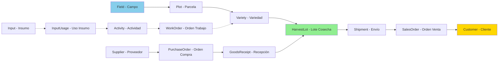

# 🔍 Módulo de Trazabilidad

## Índice
- [Descripción General](#descripción-general)
- [Cadena de Trazabilidad](#cadena-de-trazabilidad)
- [Endpoints](#endpoints)
- [Casos de Uso](#casos-de-uso)
- [Implementación](#implementación)

---

## Descripción General

El módulo de trazabilidad permite rastrear el origen y destino completo de cada lote de nueces, desde el campo hasta el cliente final, garantizando transparencia total en la cadena de suministro.

### Características Principales

- 🔮 **Trazabilidad hacia Atrás** - Del cliente al origen
- 🔮 **Trazabilidad hacia Adelante** - Del origen al cliente
- 🔮 **Cadena Completa** - Todos los intermediarios
- 🔮 **Certificación** - Documentos adjuntos
- 🔮 **Códigos QR** - Acceso rápido a información
- 🔮 **Auditoría** - Historial de cambios

### Estado

🔮 **FUTURO - NO IMPLEMENTADO**

> **Nota para desarrolladores:** Este módulo requiere que todos los módulos previos estén implementados. Se recomienda como última fase del proyecto.

---

## Cadena de Trazabilidad

### Flujo Completo



---

### Trazabilidad hacia Atrás (Backward)

**Pregunta:** ¿De dónde viene este lote que le vendí al cliente?

**Flujo:**
```
Cliente → SalesOrder → Shipment → ShipmentLotDetail → HarvestLot
  ↓
  Si source = HARVEST:
    HarvestLot → Variety → Plot → Field → Manager (CAPATAZ)
    + WorkOrders realizadas
    + Activities ejecutadas
    + Inputs utilizados
  
  Si source = PURCHASE:
    HarvestLot → Supplier → PurchaseOrder → GoodsReceipt
```

---

### Trazabilidad hacia Adelante (Forward)

**Pregunta:** ¿A dónde fue este lote que cosechamos/compramos?

**Flujo:**
```
HarvestLot → ShipmentLotDetail → Shipment → SalesOrder → Customer
```

---

## Endpoints

### 🔍 Traceability

#### GET /traceability/harvest-lot/:id

Obtener trazabilidad completa de un lote.

**Autorización:** Autenticado

**Request:**
```
GET /traceability/harvest-lot/hl-uuid-1
Authorization: Bearer {token}
```

**Response (200) - Lote de Cosecha Propia:**
```json
{
  "harvestLot": {
    "id": "hl-uuid-1",
    "caliber": "CHANDLER",
    "quantity": 1800.00,
    "harvestDate": "2025-03-15",
    "source": "HARVEST",
    "status": "SOLD"
  },
  
  "origin": {
    "type": "HARVEST",
    "field": {
      "id": "field-uuid-1",
      "name": "Campo Norte",
      "location": "Mendoza - Luján de Cuyo",
      "manager": {
        "id": "capataz-uuid-1",
        "name": "Juan Pérez"
      }
    },
    "plot": {
      "id": "plot-uuid-1",
      "plotNumber": "N-01",
      "area": 10.00,
      "soilType": "Franco-arcilloso",
      "irrigationSystem": "Goteo"
    },
    "variety": {
      "id": "variety-uuid-1",
      "varietyName": "CHANDLER",
      "treeCount": 250,
      "plantingDate": "2020-05-15"
    }
  },
  
  "production": {
    "workOrders": [
      {
        "id": "wo-uuid-1",
        "title": "Cosecha campo norte",
        "startDate": "2025-03-10",
        "assignedTo": {
          "name": "Pedro González"
        },
        "activities": [
          {
            "id": "activity-uuid-1",
            "activityType": "HARVEST",
            "activityDate": "2025-03-15",
            "hoursWorked": 8.00,
            "inputUsages": []
          }
        ]
      }
    ],
    "inputs": [
      {
        "name": "Fertilizante NPK",
        "totalUsed": 50.00,
        "activities": ["Fertilización primavera"]
      }
    ]
  },
  
  "sales": {
    "shipments": [
      {
        "id": "shipment-uuid-1",
        "shipmentNumber": "SH-2025-001",
        "shipmentDate": "2025-03-20",
        "quantityShipped": 1000.00,
        "carrier": "Transporte Rápido SA",
        "trackingNumber": "TR123456789",
        "salesOrder": {
          "id": "so-uuid-1",
          "orderNumber": "SO-2025-001",
          "customer": {
            "id": "customer-uuid-1",
            "name": "Distribuidora Norte SA",
            "city": "Buenos Aires"
          }
        }
      }
    ],
    "totalSold": 1000.00,
    "remaining": 800.00
  },
  
  "certificates": [
    {
      "type": "ORGANIC",
      "issuedBy": "Certificadora Argentina",
      "issuedDate": "2025-01-15",
      "expiryDate": "2026-01-15",
      "documentUrl": "https://..."
    }
  ],
  
  "timeline": [
    {
      "date": "2020-05-15",
      "event": "Plantación de variedad CHANDLER",
      "type": "PLANTING"
    },
    {
      "date": "2025-03-15",
      "event": "Cosecha realizada - 1800 kg",
      "type": "HARVEST"
    },
    {
      "date": "2025-03-20",
      "event": "Envío a Distribuidora Norte SA - 1000 kg",
      "type": "SHIPMENT"
    }
  ]
}
```

---

**Response (200) - Lote Comprado:**
```json
{
  "harvestLot": {
    "id": "hl-uuid-2",
    "caliber": "SERR",
    "quantity": 500.00,
    "harvestDate": "2025-01-20",
    "source": "PURCHASE",
    "status": "IN_STOCK"
  },
  
  "origin": {
    "type": "PURCHASE",
    "supplier": {
      "id": "supplier-uuid-1",
      "name": "Proveedor García",
      "contactName": "Juan García",
      "city": "Mendoza"
    },
    "purchaseOrder": {
      "id": "po-uuid-1",
      "orderNumber": "PO-2025-001",
      "orderDate": "2025-01-10",
      "totalAmount": 10000.00
    },
    "goodsReceipt": {
      "id": "gr-uuid-1",
      "receiptNumber": "GR-2025-001",
      "receiptDate": "2025-01-20",
      "unitPrice": 20.00
    }
  },
  
  "sales": {
    "shipments": [],
    "totalSold": 0.00,
    "remaining": 500.00
  },
  
  "timeline": [
    {
      "date": "2025-01-10",
      "event": "Orden de compra creada",
      "type": "PURCHASE_ORDER"
    },
    {
      "date": "2025-01-20",
      "event": "Recepción de mercadería - 500 kg",
      "type": "GOODS_RECEIPT"
    }
  ]
}
```

---

#### GET /traceability/shipment/:id

Trazabilidad completa de un envío.

**Autorización:** Autenticado

**Request:**
```
GET /traceability/shipment/shipment-uuid-1
Authorization: Bearer {token}
```

**Response (200):**
```json
{
  "shipment": {
    "id": "shipment-uuid-1",
    "shipmentNumber": "SH-2025-001",
    "shipmentDate": "2025-03-20",
    "carrier": "Transporte Rápido SA",
    "trackingNumber": "TR123456789",
    "status": "DELIVERED"
  },
  
  "customer": {
    "id": "customer-uuid-1",
    "name": "Distribuidora Norte SA",
    "contactName": "María González",
    "address": "Av. Corrientes 1234",
    "city": "Buenos Aires"
  },
  
  "lots": [
    {
      "harvestLotId": "hl-uuid-1",
      "caliber": "CHANDLER",
      "quantity": 1000.00,
      "origin": {
        "type": "HARVEST",
        "field": "Campo Norte",
        "plot": "N-01",
        "variety": "CHANDLER",
        "harvestDate": "2025-03-15"
      }
    },
    {
      "harvestLotId": "hl-uuid-2",
      "caliber": "SERR",
      "quantity": 800.00,
      "origin": {
        "type": "PURCHASE",
        "supplier": "Proveedor García",
        "receiptDate": "2025-01-20"
      }
    }
  ],
  
  "documents": [
    {
      "type": "INVOICE",
      "number": "FC-2025-001",
      "date": "2025-03-20",
      "url": "https://..."
    },
    {
      "type": "DELIVERY_NOTE",
      "number": "REM-2025-001",
      "date": "2025-03-20",
      "url": "https://..."
    }
  ]
}
```

---

#### GET /traceability/qr/:code

Obtener información por código QR.

**Autorización:** Público (sin autenticación)

**Request:**
```
GET /traceability/qr/HL-2025-001-CHANDLER
```

**Response (200):**
```json
{
  "type": "HARVEST_LOT",
  "entityId": "hl-uuid-1",
  "caliber": "CHANDLER",
  "quantity": 1800.00,
  "origin": {
    "field": "Campo Norte",
    "location": "Mendoza - Luján de Cuyo",
    "harvestDate": "2025-03-15"
  },
  "certifications": [
    "Orgánico",
    "GlobalGAP"
  ],
  "detailsUrl": "https://app.tejadahnos.com/traceability/harvest-lot/hl-uuid-1"
}
```

---

## Casos de Uso

### Caso 1: Cliente Escanea QR en Producto

**Actor:** Cliente final

**Flujo:**
1. Cliente compra producto con QR
2. Escanea código QR
3. Sistema muestra origen del lote
4. Cliente ve campo, fecha de cosecha, certificaciones

**Implementación:**
```typescript
const getTraceabilityFromQR = async (qrCode: string) => {
  // QR format: HL-YYYY-NNN-CALIBER
  // Ejemplo: HL-2025-001-CHANDLER
  
  const [type, year, number, caliber] = qrCode.split('-');
  
  const lot = await harvestLotRepo.findOne({
    where: {
      // Buscar por código o ID
    },
    relations: [
      'variety',
      'variety.plot',
      'variety.plot.field',
      'supplier',
      'shipmentDetails',
      'shipmentDetails.shipment',
      'shipmentDetails.shipment.salesOrder',
      'shipmentDetails.shipment.salesOrder.customer'
    ]
  });
  
  return {
    type: 'HARVEST_LOT',
    entityId: lot.id,
    caliber: lot.caliber,
    quantity: lot.quantity,
    origin: lot.source === 'HARVEST' ? {
      field: lot.variety.plot.field.name,
      location: lot.variety.plot.field.location,
      harvestDate: lot.harvestDate
    } : {
      supplier: lot.supplier.name,
      receiptDate: lot.harvestDate
    },
    certifications: await getCertifications(lot.id),
    detailsUrl: `${process.env.FRONTEND_URL}/traceability/harvest-lot/${lot.id}`
  };
};
```

---

### Caso 2: Auditoría de Calidad

**Actor:** Auditor externo

**Flujo:**
1. Auditor solicita trazabilidad de lote específico
2. Sistema genera reporte completo
3. Incluye todas las actividades realizadas
4. Muestra insumos utilizados
5. Verifica cumplimiento de normas

**Código:**
```typescript
const generateAuditReport = async (harvestLotId: string) => {
  const lot = await harvestLotService.getFullTraceability(harvestLotId);
  
  const report = {
    lotInfo: {
      id: lot.id,
      caliber: lot.caliber,
      quantity: lot.quantity,
      harvestDate: lot.harvestDate
    },
    
    origin: lot.origin,
    
    activities: lot.production?.workOrders.flatMap(wo => 
      wo.activities.map(a => ({
        date: a.activityDate,
        type: a.activityType,
        hours: a.hoursWorked,
        operator: wo.assignedTo.name,
        approved: a.status === 'APPROVED'
      }))
    ),
    
    inputs: lot.production?.inputs.map(i => ({
      name: i.name,
      quantity: i.totalUsed,
      certified: i.certified, // Si es orgánico, etc.
      safetyDatasheet: i.safetyDatasheetUrl
    })),
    
    certifications: lot.certificates,
    
    destination: lot.sales?.shipments.map(s => ({
      customer: s.salesOrder.customer.name,
      date: s.shipmentDate,
      quantity: s.quantityShipped
    }))
  };
  
  return report;
};
```

---

### Caso 3: Recall de Producto

**Escenario:** Se detecta problema de calidad en lote específico.

**Flujo:**
1. Identificar lote problemático
2. Obtener todos los envíos que incluyeron ese lote
3. Contactar a todos los clientes afectados

**Código:**
```typescript
const performProductRecall = async (harvestLotId: string) => {
  // Obtener todos los envíos que usaron este lote
  const shipmentDetails = await shipmentLotDetailRepo.find({
    where: { harvestLotId },
    relations: [
      'shipment',
      'shipment.salesOrder',
      'shipment.salesOrder.customer'
    ]
  });
  
  // Agrupar por cliente
  const affectedCustomers = new Map<string, {
    customer: Customer;
    shipments: Array<{
      shipmentNumber: string;
      date: Date;
      quantity: number;
    }>;
    totalQuantity: number;
  }>();
  
  for (const detail of shipmentDetails) {
    const customerId = detail.shipment.salesOrder.customerId;
    
    if (!affectedCustomers.has(customerId)) {
      affectedCustomers.set(customerId, {
        customer: detail.shipment.salesOrder.customer,
        shipments: [],
        totalQuantity: 0
      });
    }
    
    const entry = affectedCustomers.get(customerId)!;
    entry.shipments.push({
      shipmentNumber: detail.shipment.shipmentNumber,
      date: detail.shipment.shipmentDate,
      quantity: detail.quantity
    });
    entry.totalQuantity += detail.quantity;
  }
  
  // Generar reporte y notificar
  console.log(`
    ⚠️ RECALL DE PRODUCTO
    Lote afectado: ${harvestLotId}
    
    Clientes a contactar: ${affectedCustomers.size}
    
    ${Array.from(affectedCustomers.values()).map(entry => `
      Cliente: ${entry.customer.name}
      Email: ${entry.customer.email}
      Cantidad total recibida: ${entry.totalQuantity} kg
      Envíos:
      ${entry.shipments.map(s => `  - ${s.shipmentNumber}: ${s.quantity} kg (${s.date})`).join('\n')}
    `).join('\n\n')}
  `);
  
  // Enviar notificaciones
  for (const [_, entry] of affectedCustomers) {
    await notificationService.send({
      to: entry.customer.email,
      subject: '⚠️ IMPORTANTE: Recall de Producto',
      body: `...`
    });
  }
  
  return {
    affectedCustomers: affectedCustomers.size,
    totalQuantityAffected: Array.from(affectedCustomers.values())
      .reduce((sum, e) => sum + e.totalQuantity, 0),
    customers: Array.from(affectedCustomers.values())
  };
};
```

---

## Implementación

### 1. Códigos QR

**Generar QR para Lote:**
```typescript
import QRCode from 'qrcode';

const generateQRForLot = async (harvestLot: HarvestLot): Promise<string> => {
  // Formato: HL-YYYY-NNN-CALIBER
  const code = `HL-${dayjs(harvestLot.harvestDate).format('YYYY')}-${harvestLot.id.slice(0, 8)}-${harvestLot.caliber}`;
  
  const qrUrl = `${process.env.FRONTEND_URL}/traceability/qr/${code}`;
  
  // Generar imagen QR
  const qrImage = await QRCode.toDataURL(qrUrl, {
    width: 300,
    margin: 2
  });
  
  return qrImage; // Base64 image
};
```

---

### 2. Blockchain (Opcional)

**Para trazabilidad inmutable:**
```typescript
interface BlockchainRecord {
  timestamp: number;
  entityType: 'HARVEST_LOT' | 'SHIPMENT' | 'SALES_ORDER';
  entityId: string;
  action: string;
  data: any;
  hash: string;
  previousHash: string;
}

const recordToBlockchain = async (record: Omit<BlockchainRecord, 'hash' | 'previousHash'>) => {
  // Integración con blockchain (Ethereum, Hyperledger, etc.)
  // O implementación simple de blockchain privada
  
  const previousBlock = await getLastBlock();
  const hash = calculateHash(record, previousBlock.hash);
  
  const block: BlockchainRecord = {
    ...record,
    hash,
    previousHash: previousBlock.hash
  };
  
  await saveBlock(block);
  
  return block;
};
```

---

### 3. Documentos Adjuntos

**Certificaciones y Documentos:**
```typescript
@Entity('traceability_documents')
export class TraceabilityDocument {
  @PrimaryGeneratedColumn('uuid')
  id: string;
  
  @Column({ type: 'enum', enum: DocumentType })
  type: DocumentType; // CERTIFICATE, ANALYSIS, PHOTO, etc.
  
  @Column()
  entityType: string; // 'HARVEST_LOT', 'FIELD', etc.
  
  @Column('uuid')
  entityId: string;
  
  @Column()
  name: string;
  
  @Column({ nullable: true })
  description: string;
  
  @Column()
  fileUrl: string; // S3, Cloudinary, etc.
  
  @Column({ type: 'date', nullable: true })
  issuedDate: Date;
  
  @Column({ type: 'date', nullable: true })
  expiryDate: Date;
  
  @CreateDateColumn()
  createdAt: Date;
}
```

---

## Mejoras Futuras

- [ ] App móvil para escaneo de QR
- [ ] Integración con blockchain público
- [ ] Fotos en cada etapa de producción
- [ ] Videos del proceso productivo
- [ ] Sensores IoT (temperatura, humedad)
- [ ] Integración con drones (mapeo de campos)
- [ ] Análisis de suelo por lote
- [ ] Certificaciones digitales (NFT)
- [ ] Compartir trazabilidad con clientes (portal)
- [ ] Cumplimiento de normas internacionales (GFSI, IFS)

---

**Documentación relacionada:**
- [04-PRODUCCION.md](./04-PRODUCCION.md) - Origen de lotes de cosecha
- [03-COMPRAS.md](./03-COMPRAS.md) - Origen de lotes comprados
- [06-VENTAS.md](./06-VENTAS.md) - Destino de lotes vendidos
- [05-OPERACIONES.md](./05-OPERACIONES.md) - Actividades en producción
- [MODELO_DATOS.md](../MODELO_DATOS.md) - Todas las entidades relacionadas
